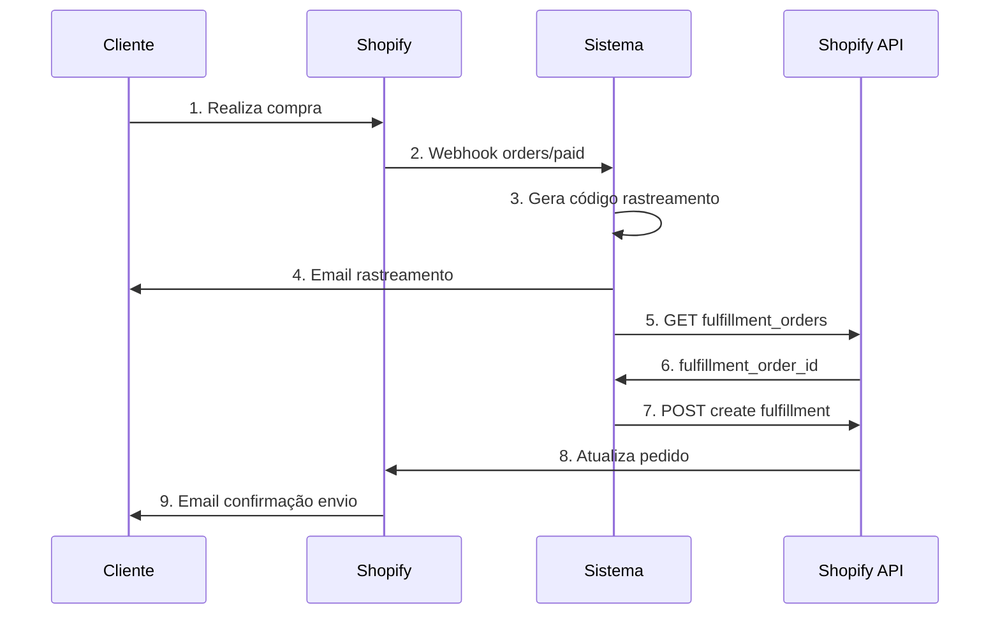

# 📦 Integração Shopify - Processamento Automático de Fulfillment

## 📋 Índice
1. [Visão Geral](#visão-geral)
2. [Como Funciona](#como-funciona)
3. [Configuração Passo a Passo](#configuração-passo-a-passo)
4. [Requisitos da API Shopify](#requisitos-da-api-shopify)
5. [Estrutura Técnica](#estrutura-técnica)
6. [Troubleshooting](#troubleshooting)
7. [FAQs](#faqs)

---

## 🎯 Visão Geral

Esta integração permite que o sistema processe **automaticamente** os pedidos da Shopify, criando fulfillments com informações de rastreamento. Quando um cliente compra na sua loja Shopify:

✅ **Sistema envia** email personalizado de rastreamento  
✅ **Shopify processa** pedido automaticamente  
✅ **Shopify envia** email oficial de confirmação de envio  
✅ **Pedido fica** marcado como "Enviado" na Shopify  

**Resultado:** Cliente recebe DOIS emails (sistema + Shopify) e você não precisa processar pedidos manualmente!

---

## ⚙️ Como Funciona



---

## 🚀 Configuração Passo a Passo

### **Passo 1: Executar Script SQL**

No Supabase Dashboard, execute:

```sql
-- Arquivo: scripts/add-shopify-fulfillment-fields.sql
ALTER TABLE shopify_configs
ADD COLUMN IF NOT EXISTS shop_url VARCHAR(255),
ADD COLUMN IF NOT EXISTS api_access_token TEXT,
ADD COLUMN IF NOT EXISTS auto_fulfill BOOLEAN DEFAULT true,
ADD COLUMN IF NOT EXISTS tracking_company VARCHAR(100) DEFAULT 'Custom';
```

### **Passo 2: Criar App na Shopify**

1. Acesse **Configurações → Apps e canais de vendas**
2. Clique em **Desenvolver apps**
3. Clique em **Criar um app**
4. Nome do app: `Integração Rastreamento`
5. Clique em **Criar APP**

### **Passo 3: Configurar Permissões da API**

Clique em **Configurar escopos da API Admin** e selecione:

- ✅ `read_orders`
- ✅ `write_orders`
- ✅ `read_order_edits`
- ✅ `write_order_edits`
- ✅ `read_merchant_managed_fulfillment_orders`
- ✅ `write_merchant_managed_fulfillment_orders`
- ✅ `write_fulfillments` ⭐ **CRÍTICO**

Clique em **Salvar**.

### **Passo 4: Instalar App e Obter Token**

1. Clique em **Credenciais da API**
2. Clique em **Instalar APP**
3. Clique em **Revelar token uma vez**
4. **COPIE O TOKEN** (começa com `shpat_...`)

### **Passo 5: Configurar no Sistema**

Acesse: **Dashboard → Configurações Shopify**

1. Configure o **Webhook Secret** (já configurado anteriormente)
2. Ative **Processamento Automático**
3. Informe **URL da Loja**: `minhaloja.myshopify.com`
4. Cole o **Token de Acesso** copiado
5. Escolha a **Transportadora** (ex: Correios)
6. Clique em **Salvar Tudo**

✅ **Pronto!** A integração está ativa.

---

## 🔑 Requisitos da API Shopify

### **Escopos Obrigatórios:**

```typescript
const REQUIRED_SCOPES = [
  'read_orders',                                  // Ler pedidos
  'write_orders',                                 // Modificar pedidos
  'read_order_edits',                            // Ler edições
  'write_order_edits',                           // Modificar edições
  'read_merchant_managed_fulfillment_orders',    // Ler fulfillment orders
  'write_merchant_managed_fulfillment_orders',   // Criar fulfillments
  'write_fulfillments'                           // ⭐ CRÍTICO para criar fulfillments
];
```

### **Endpoints Utilizados:**

1. **GET** `/admin/api/2024-01/orders/{order_id}/fulfillment_orders.json`
   - Busca fulfillment orders do pedido
   
2. **POST** `/admin/api/2024-01/fulfillments.json`
   - Cria fulfillment com tracking info
   - Aciona email da Shopify quando `notify_customer: true`

---

## 🛠️ Estrutura Técnica

### **Arquivos Criados/Modificados:**

```
📁 scripts/
  └── add-shopify-fulfillment-fields.sql    (SQL para adicionar campos)

📁 src/lib/
  ├── shopifyAdminAPI.ts                     (Cliente da API Admin)
  ├── shopifyFulfillment.ts                  (Orquestrador de fulfillment)
  └── shopifyConfig.ts                       (ATUALIZADO: novos campos)

📁 src/pages/
  └── FreelancerShopifyConfig.tsx            (ATUALIZADO: interface completa)

📁 src/webhook-server/handlers/
  └── genericWebhookHandler.ts               (ATUALIZADO: lógica de fulfillment)
```

### **Fluxo de Dados:**

```typescript
// 1. Webhook recebe pedido pago
webhookHandler.ts → shopifyConfig (busca configuração)

// 2. Se auto_fulfill = true
→ shopifyFulfillment.ts (orquestra processo)
  → shopifyAdminAPI.ts (GET fulfillment_orders)
  → shopifyAdminAPI.ts (POST create fulfillment)

// 3. Shopify envia email ao cliente
```

### **Estrutura do Fulfillment Request:**

```json
{
  "fulfillment": {
    "line_items_by_fulfillment_order": [
      {
        "fulfillment_order_id": 12345678,
        "fulfillment_order_line_items": [
          {"id": 987654321, "quantity": 1}
        ]
      }
    ],
    "tracking_info": {
      "number": "VF123456789BR",
      "url": "https://seusite.com/rastreamento/VF123456789BR",
      "company": "Correios"
    },
    "notify_customer": true
  }
}
```

---

## 🔧 Troubleshooting

### **Problema 1: Fulfillment não está sendo criado**

**Verificar:**
1. ✅ `auto_fulfill` está marcado?
2. ✅ `shop_url` está preenchido?
3. ✅ `api_access_token` está correto?
4. ✅ Token tem permissão `write_fulfillments`?

**Logs no webhook server:**
```
[Webhook] 🔍 Verificando configuração de fulfillment automático...
[Webhook] ✅ Auto-fulfill ativado, verificando credenciais...
[Webhook] ✅ Credenciais encontradas, iniciando fulfillment...
```

### **Problema 2: Erro 401 Unauthorized**

**Causa:** Token inválido ou expirado

**Solução:**
1. Volte ao painel da Shopify
2. Apps → Seu App → Credenciais da API
3. Gere um **novo token**
4. Atualize no sistema

### **Problema 3: Erro 404 Not Found**

**Causa:** URL da loja incorreta

**Solução:**
- Verifique que está no formato: `minhaloja.myshopify.com`
- **SEM** `https://`
- **SEM** `/` no final

### **Problema 4: Fulfillment Order não encontrado**

**Causa:** Pedido já processado ou cancelado

**Solução:**
- Verificar status do pedido na Shopify
- Status válidos para fulfillment: `open`, `in_progress`

### **Problema 5: Email da Shopify não está sendo enviado**

**Verificar:**
1. ✅ `notify_customer: true` no código
2. ✅ Configurações de email na Shopify estão ativas
3. ✅ Cliente tem email válido no pedido

---

## ❓ FAQs

### **1. Posso desativar o fulfillment automático?**

Sim! Desmarque a opção "Ativar processamento automático" nas configurações.

### **2. O que acontece se a API da Shopify falhar?**

O webhook **não falha**. O pedido e email do sistema são criados normalmente. Apenas o fulfillment da Shopify não é processado.

### **3. Posso processar pedidos antigos?**

Não automaticamente. O sistema apenas processa novos pedidos após a configuração estar ativa.

### **4. Quantos emails o cliente recebe?**

**DOIS emails:**
1. Email do sistema (rastreamento personalizado)
2. Email da Shopify (confirmação oficial de envio)

### **5. O fulfillment atualiza o status na Shopify?**

Sim! O pedido fica marcado como "Enviado" (Fulfilled) na Shopify automaticamente.

### **6. Funciona com fulfillment parcial?**

Sim! O sistema cria fulfillment para todos os itens do pedido.

### **7. Posso customizar o nome da transportadora?**

Sim! Altere nas configurações. Sugestões:
- Custom (Personalizado)
- Correios
- FedEx, DHL, UPS

### **8. Qual versão da API é usada?**

Atualmente: **2024-01** (mais recente estável)

### **9. Preciso reconfigurar o webhook?**

Não! O webhook existente continua funcionando normalmente.

### **10. Há limite de requisições à API?**

Sim. Shopify tem rate limits. O sistema trata isso automaticamente com logs de erro sem falhar o webhook.

---

## 📊 Monitoramento

### **Logs de Sucesso:**

```
[Webhook] 🔍 Verificando configuração de fulfillment automático...
[Webhook] ✅ Auto-fulfill ativado, verificando credenciais...
[Webhook] ✅ Credenciais encontradas, iniciando fulfillment...
[ShopifyFulfillment] 📦 Iniciando processamento automático...
[ShopifyFulfillment] 🔍 Buscando fulfillment orders...
[ShopifyFulfillment] ✅ 1 fulfillment order(s) encontrado(s)
[ShopifyFulfillment] 🚀 Criando fulfillment na Shopify...
[ShopifyFulfillment] ✅ Fulfillment criado com sucesso!
[ShopifyFulfillment] 📧 Shopify enviará email de confirmação ao cliente
[Webhook] ✅ Fulfillment criado com sucesso na Shopify!
```

### **Logs de Aviso:**

```
[Webhook] ⚠️ Credenciais de API não configuradas
[Webhook] ℹ️ Auto-fulfill desativado pelo usuário
[ShopifyFulfillment] ⚠️ Fulfillment order com status 'closed' não pode ser processado
```

### **Logs de Erro:**

```
[Webhook] ❌ Falha ao criar fulfillment: Shopify API Error: 401
[ShopifyFulfillment] ❌ Erro ao processar fulfillment: Token inválido
```

---

## 🎉 Resultado Final

Quando tudo estiver configurado corretamente:

1. ✅ Cliente compra na Shopify
2. ✅ Sistema recebe webhook
3. ✅ Sistema cria pedido + código rastreamento
4. ✅ **Sistema envia email de rastreamento** ← Email 1
5. ✅ Sistema chama API Admin da Shopify
6. ✅ Sistema cria fulfillment com tracking
7. ✅ **Shopify envia email de confirmação** ← Email 2
8. ✅ Pedido marcado como "Enviado" na Shopify

**Você não precisa fazer NADA manualmente!** 🎊

---

## 📞 Suporte

Se precisar de ajuda:
1. Verifique os logs do webhook server
2. Consulte a seção de Troubleshooting
3. Valide as permissões da API na Shopify
4. Teste com um pedido novo na Shopify

---

**Documentação criada em:** 19/10/2025  
**Versão:** 1.0  
**Última atualização:** 19/10/2025