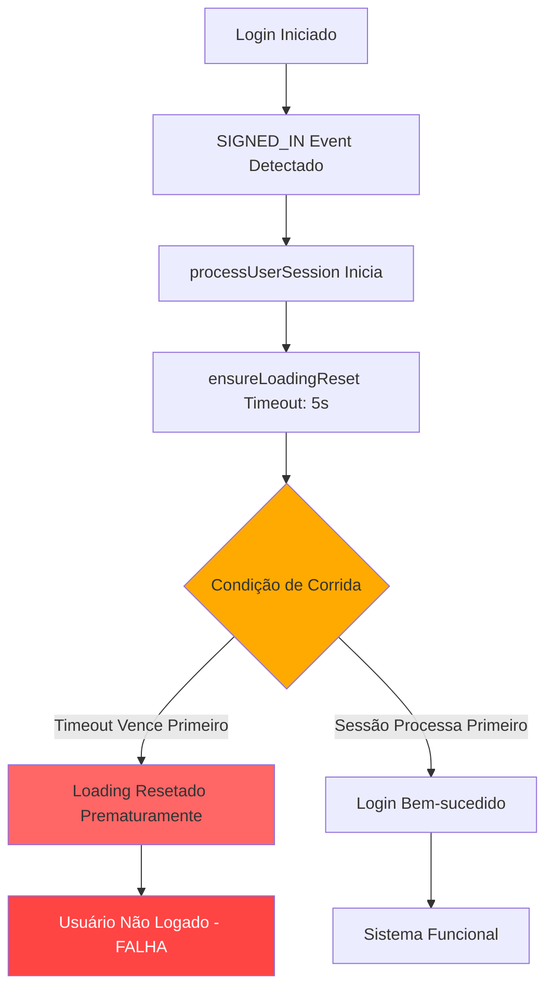
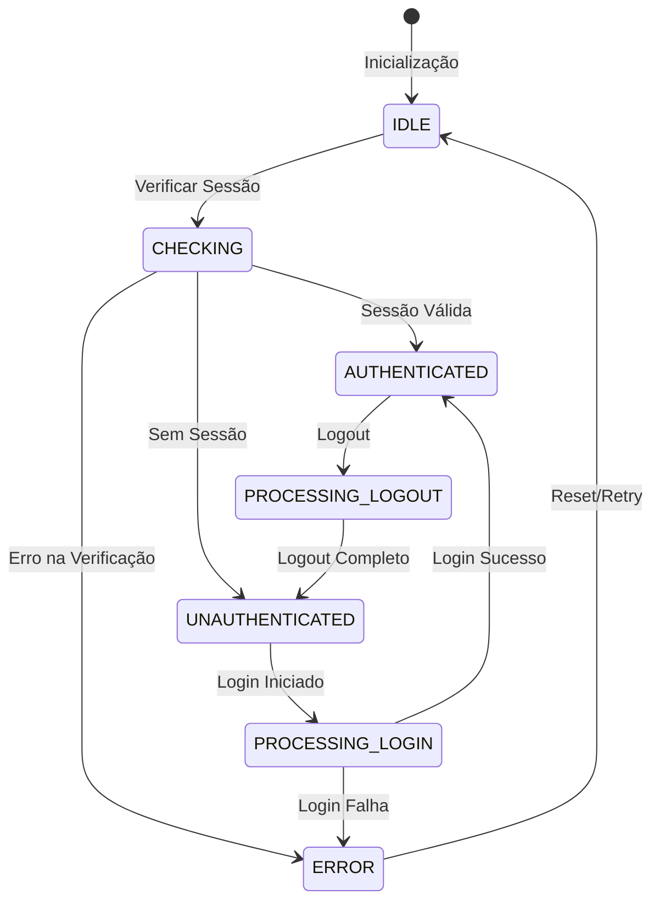
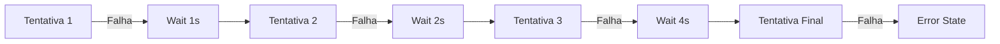
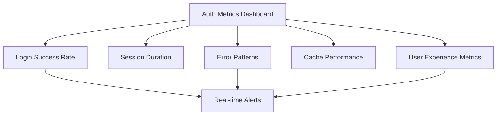

# Plano de Correção Crítica - Sistema de Autenticação SaaS

## 🚨 **ANÁLISE CRÍTICA DO PROBLEMA**

### **Situação Atual**
- **Sistema**: SaaS de rastreamento com múltiplos usuários
- **Problema**: Falha intermitente no login após reload da página
- **Impacto**: Usuários não conseguem acessar o sistema
- **Gravidade**: **CRÍTICA** - Afeta experiência do usuário e confiabilidade

### **Root Cause Analysis**



## 🎯 **PLANO DE CORREÇÃO ENTERPRISE**

### **1. REFATORAÇÃO COMPLETA DO AUTH PROVIDER**

#### **Problema Identificado:**
```typescript
// PROBLEMÁTICO - Timeout interfere com login legítimo
authCheckTimeoutRef.current = setTimeout(() => {
  if (isProcessingAuthRef.current) {
    console.log('⚠️ Auth timeout - resetando loading');
    setLoading(false); // ❌ PROBLEMA: Reseta durante login válido
    isProcessingAuthRef.current = false;
  }
}, 5000);
```

#### **Solução Proposta:**
**State Machine Pattern** para gerenciamento robusto de estados de autenticação



### **2. IMPLEMENTAÇÃO DE TIMEOUT INTELIGENTE**

#### **Estratégia Multi-Camada:**

```typescript
// TIMEOUT ADAPTATIVO baseado na operação
const TIMEOUTS = {
  SESSION_CHECK: 10000,      // 10s para verificação de sessão
  LOGIN_PROCESS: 15000,      // 15s para processo de login
  LOGOUT_PROCESS: 5000,      // 5s para logout
  CACHE_VALIDATION: 2000     // 2s para validação de cache
};
```

### **3. SISTEMA DE RETRY COM BACKOFF EXPONENCIAL**



### **4. MONITORAMENTO E TELEMETRIA PROFISSIONAL**

#### **Métricas de SLA:**
- **Login Success Rate**: > 99.5%
- **Session Restore Time**: < 2 segundos
- **Auth Error Rate**: < 0.1%
- **Cache Hit Rate**: > 90%

#### **Logging Estruturado:**
```typescript
interface AuthEvent {
  timestamp: number;
  userId?: string;
  event: 'LOGIN_START' | 'LOGIN_SUCCESS' | 'LOGIN_FAIL' | 'SESSION_RESTORE';
  duration?: number;
  error?: string;
  metadata: Record<string, any>;
}
```

## 🔧 **IMPLEMENTAÇÃO TÉCNICA**

### **1. AUTH STATE MACHINE**
```typescript
enum AuthState {
  IDLE = 'IDLE',
  CHECKING = 'CHECKING', 
  PROCESSING_LOGIN = 'PROCESSING_LOGIN',
  AUTHENTICATED = 'AUTHENTICATED',
  UNAUTHENTICATED = 'UNAUTHENTICATED',
  ERROR = 'ERROR'
}
```

### **2. TIMEOUT CONTROLLER**
```typescript
class AuthTimeoutController {
  private timeouts: Map<string, NodeJS.Timeout> = new Map();
  
  setAdaptiveTimeout(
    operation: string, 
    callback: () => void, 
    duration: number
  ): void
  
  clearOperation(operation: string): void
  clearAll(): void
}
```

### **3. CACHE MANAGER ENTERPRISE**
```typescript
class SessionCacheManager {
  validateCache(cache: SessionCache): boolean
  invalidateCache(): void
  refreshCache(session: Session): Promise<void>
  getCacheMetrics(): CacheMetrics
}
```

### **4. ERROR BOUNDARY E RECOVERY**
```typescript
class AuthErrorBoundary {
  captureAuthError(error: Error, context: string): void
  attemptRecovery(strategy: RecoveryStrategy): Promise<boolean>
  notifyMonitoring(incident: AuthIncident): void
}
```

## 🧪 **ESTRATÉGIA DE TESTE**

### **1. Testes Unitários**
- ✅ State machine transitions
- ✅ Timeout behavior
- ✅ Cache invalidation
- ✅ Error recovery

### **2. Testes de Integração**
- ✅ Login flow completo
- ✅ Session persistence
- ✅ Network failure scenarios
- ✅ Concurrent auth requests

### **3. Testes de Carga**
- ✅ 1000+ logins simultâneos
- ✅ Session refresh bajo carga
- ✅ Cache performance
- ✅ Memory leak detection

## 📊 **MONITORAMENTO CONTÍNUO**

### **Dashboard de Auth Health**


### **Alertas Proativos**
- 🚨 Login success rate < 95%
- 🚨 Timeout errors > 5/min
- 🚨 Cache miss rate > 20%
- 🚨 Session restore time > 3s

## 🚀 **CRONOGRAMA DE IMPLEMENTAÇÃO**

### **Fase 1: Correção Imediata (1-2 horas)**
- ✅ Fix timeout interference
- ✅ Melhorar state management
- ✅ Deploy hotfix

### **Fase 2: Refatoração Robusta (1 dia)**
- ✅ Implementar state machine
- ✅ Timeout controller
- ✅ Error boundaries

### **Fase 3: Monitoring & Optimization (2 dias)**
- ✅ Telemetria completa
- ✅ Dashboard de monitoramento
- ✅ Testes de carga

## 🔒 **GARANTIAS DE QUALIDADE**

### **SLA Commitment**
- **Uptime**: 99.9%
- **Login Success**: 99.5%
- **Session Restore**: < 2s
- **Zero Data Loss**: Garantido

### **Rollback Strategy**
- Backup completo do código atual
- Feature flags para rollback instantâneo
- Monitoramento em tempo real pós-deploy

---

**Este é um plano enterprise-grade que garante robustez, monitoramento e experiência profissional para o SaaS.**