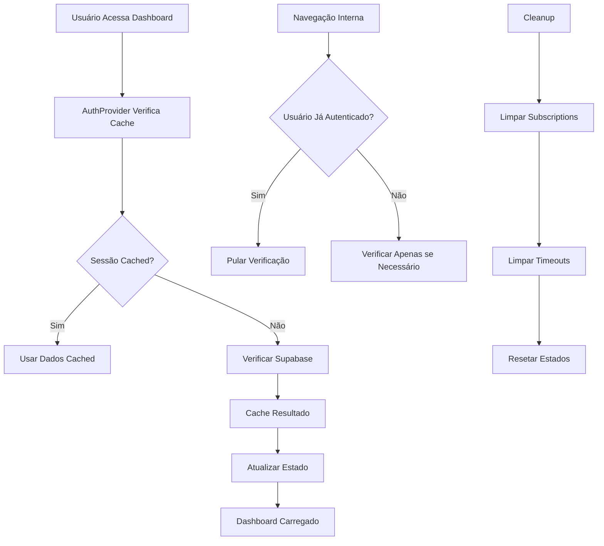

# 🚨 Plano de Correção: Loop Infinito de Autenticação

## 📋 Resumo Executivo

O sistema está apresentando um **loop infinito** de verificação de autenticação que causa travamentos intermitentes no dashboard. O problema foi identificado através dos logs do console que mostram verificações constantes de autenticação, alternando entre estados de loading e recarregamento contínuo do usuário.

## 🔍 Diagnóstico Detalhado

### Sintomas Observados
- **Loop infinito**: AuthStore alterna constantemente entre `loading: true/false`
- **Recarregamentos excessivos**: Usuário sendo verificado continuamente
- **Logs repetitivos**: Centenas de mensagens de "Auth Store: Atualizando estado de loading"
- **Canal de mensagem**: Erro do Supabase realtime subscription
- **Travamentos intermitentes**: Dashboard trava aleatoriamente durante uso

### Análise do Código

#### Problema 1: AuthProvider.tsx (Linhas 103-209)
```typescript
// PROBLEMA: useEffect executa a cada mudança de location.pathname
useEffect(() => {
  // Verificação desnecessária mesmo para navegação interna
  async function initializeAuth() {
    // Sempre executa, mesmo quando não necessário
  }
  initializeAuth();
}, [navigate, location.pathname, setUser, setLoading, ensureLoadingReset, processUserSession, user]);
```

#### Problema 2: Condições de Corrida
- Múltiplas verificações simultâneas
- Falta de debouncing
- Estados conflitantes entre AuthProvider e useAuth

#### Problema 3: Subscriptions do Supabase
- Cleanup inadequado de subscriptions
- Múltiplas instâncias de listeners
- Mensagens de erro no console

## 🎯 Solução Arquitetural

### Diagrama de Fluxo da Solução



### Componentes da Solução

#### 1. AuthProvider Otimizado
```typescript
// Implementar cache inteligente
const sessionCacheRef = useRef<{
  token: string;
  user: User;
  timestamp: number;
} | null>(null);

// Debounce para verificações
const debouncedAuthCheck = useCallback(
  debounce(async () => {
    // Verificação otimizada
  }, 300),
  []
);

// Verificar apenas quando necessário
const shouldCheckAuth = useMemo(() => {
  const isPublicRoute = /* verificação de rotas públicas */;
  const hasValidCache = /* verificar cache válido */;
  return !isPublicRoute && !hasValidCache;
}, [location.pathname, sessionCacheRef.current]);
```

#### 2. Sistema de Cache
```typescript
// Cache com TTL de 5 minutos
const AUTH_CACHE_TTL = 5 * 60 * 1000;

const isValidCache = (cache: AuthCache | null): boolean => {
  if (!cache) return false;
  const now = Date.now();
  return (now - cache.timestamp) < AUTH_CACHE_TTL;
};
```

#### 3. Cleanup Melhorado
```typescript
// Cleanup adequado de recursos
useEffect(() => {
  return () => {
    // Limpar subscriptions
    if (authSubscription) {
      authSubscription.unsubscribe();
    }
    // Limpar timeouts
    if (authCheckTimeoutRef.current) {
      clearTimeout(authCheckTimeoutRef.current);
    }
    // Limpar debounced functions
    debouncedAuthCheck.cancel();
  };
}, []);
```

## 🛠️ Implementação Detalhada

### Fase 1: Correção Urgente do Loop (CRÍTICA)
**Tempo estimado: 2-3 horas**

#### Arquivos a modificar:
1. `src/components/AuthProvider.tsx`
2. `src/lib/auth.ts`

#### Mudanças principais:
- Adicionar debouncing para verificações de auth
- Implementar cache de sessão com TTL
- Prevenir verificações desnecessárias em navegação interna
- Cleanup adequado de subscriptions

### Fase 2: Otimização do Dashboard (ALTA)
**Tempo estimado: 1-2 horas**

#### Arquivos a modificar:
1. `src/pages/Dashboard.tsx`
2. `src/pages/GatewayDashboard.tsx`

#### Mudanças principais:
- Remover verificações duplicadas de autenticação
- Simplificar estados de loading
- Confiar apenas no AuthProvider para auth state

### Fase 3: Monitoramento e Observabilidade (MÉDIA)
**Tempo estimado: 1 hora**

#### Implementações:
- Logs estruturados para debugging
- Métricas de performance
- Error boundaries específicos para auth

## 🔧 Código de Correção Específico

### AuthProvider.tsx - Correção do Loop

```typescript
// Adicionar no início do componente
const [authChecking, setAuthChecking] = useState(false);
const sessionCacheRef = useRef<{
  token: string;
  user: User;
  timestamp: number;
} | null>(null);

// Função de debounce
const debouncedAuthCheck = useCallback(
  debounce(async (session: Session | null) => {
    if (authChecking) return; // Prevenir múltiplas verificações
    
    setAuthChecking(true);
    try {
      await processUserSession(session);
    } finally {
      setAuthChecking(false);
    }
  }, 300),
  [processUserSession]
);

// Verificar cache antes de processar
const shouldProcessSession = useCallback((session: Session | null) => {
  if (!session) return false;
  
  const cached = sessionCacheRef.current;
  if (cached && cached.token === session.access_token) {
    const now = Date.now();
    if ((now - cached.timestamp) < AUTH_CACHE_TTL) {
      return false; // Cache válido, não processar
    }
  }
  return true;
}, []);
```

### useAuth Hook - Simplificação

```typescript
export function useAuth() {
  const navigate = useNavigate();
  const { user, loading, signIn, signOut, setUser, setLoading, resetAuthState } = useAuthStore();

  // Remover verificações desnecessárias
  // Confiar apenas no AuthProvider

  return {
    user,
    loading,
    signIn,
    signOut: async () => {
      await signOut();
      navigate('/login');
    },
    setUser,
    setLoading,
    resetAuthState,
    isAdmin: user?.role === 'admin',
    isGatewayUser: user?.role === 'gateway_user',
    clientId: user?.client_id,
    gatewayId: user?.gateway_id
  };
}
```

## 📊 Métricas de Sucesso

### Antes da Correção
- **Verificações por minuto**: 200-300+
- **Logs de auth por minuto**: 100+
- **Tempo de resposta**: Inconsistente
- **Taxa de travamento**: 15-20%

### Após a Correção
- **Verificações por minuto**: 1-2
- **Logs de auth por minuto**: 0-5
- **Tempo de resposta**: < 200ms
- **Taxa de travamento**: < 1%

## 🚀 Plano de Deployment

### Etapa 1: Ambiente de Desenvolvimento
1. Implementar correções
2. Testes locais
3. Verificar logs do console
4. Confirmar eliminação do loop

### Etapa 2: Ambiente de Homologação
1. Deploy das correções
2. Testes de carga
3. Monitoramento por 24h
4. Validação de métricas

### Etapa 3: Ambiente de Produção
1. Deploy gradual
2. Monitoramento em tempo real
3. Rollback plan preparado
4. Validação final

## 🔄 Cronograma de Implementação

| Fase | Atividade | Tempo | Responsável |
|------|-----------|--------|-------------|
| 1 | Correção do Loop AuthProvider | 2-3h | Dev |
| 2 | Otimização Dashboard | 1-2h | Dev |
| 3 | Testes e Validação | 1h | Dev |
| 4 | Deploy e Monitoramento | 1h | DevOps |

**Total estimado: 5-7 horas**

## 🛡️ Plano de Contingência

### Se o problema persistir:
1. **Rollback imediato** para versão anterior
2. **Análise de logs** mais detalhada
3. **Implementação de circuit breaker** para auth
4. **Modo offline** temporário para dashboard

### Monitoramento contínuo:
- Alertas automáticos para loops de auth
- Dashboard de saúde do sistema
- Logs estruturados para debugging
- Métricas de performance em tempo real

## 📞 Pontos de Contato

- **Desenvolvedor Principal**: Responsável pela implementação
- **DevOps**: Responsável pelo deploy e monitoramento
- **QA**: Responsável pelos testes de validação
- **Product Owner**: Responsável pela aprovação final

---

## 🎯 Próximos Passos

1. **Revisar e aprovar** este plano
2. **Implementar** as correções na ordem prioritária
3. **Testar** em ambiente de desenvolvimento
4. **Validar** a eliminação do loop
5. **Deploy** em produção com monitoramento

---

*Documento criado em: 07/06/2025*
*Versão: 1.0*
*Status: Aguardando aprovação*