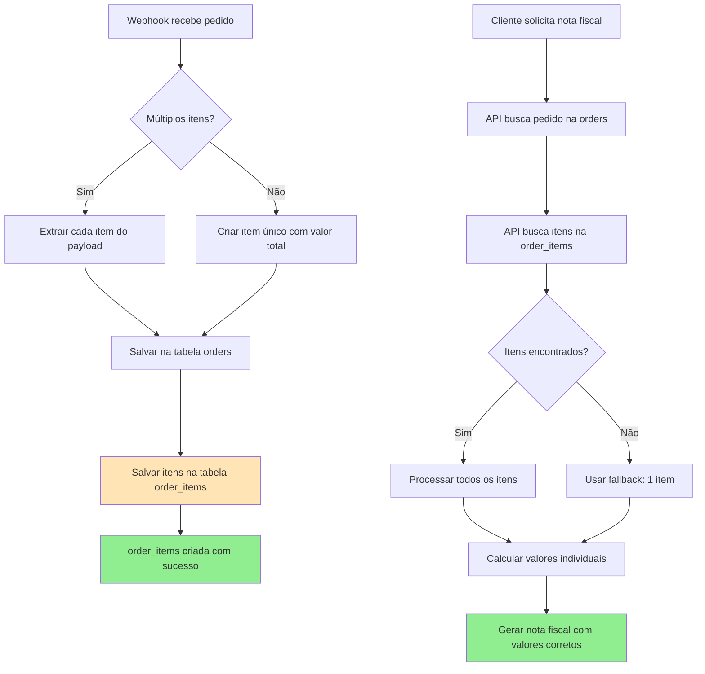
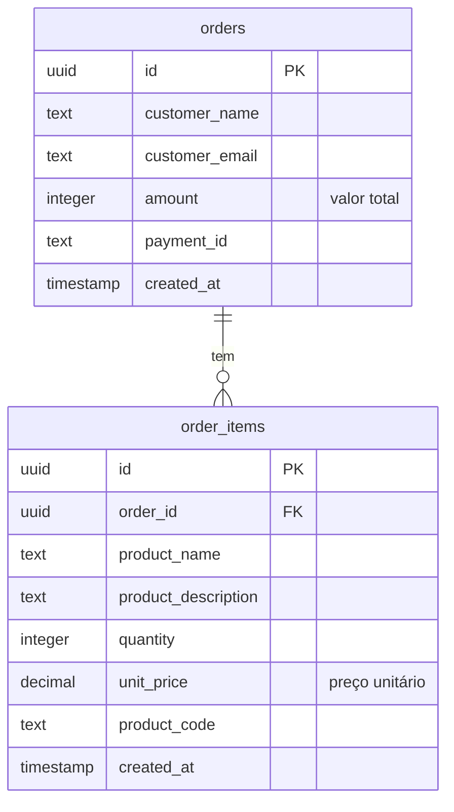

# 🛠️ Plano de Correção - Nota Fiscal com Valores Zerados

## 🎯 **Problema Identificado**
- Cliente compra 10 itens em uma única compra
- Nota fiscal mostra apenas o primeiro item com valor (R$ 165,85)
- Os outros 9 itens aparecem com R$ 0,00
- **Causa**: Tabela `order_items` não existe no banco de dados

## 🔍 **Análise Técnica**

### **Estrutura Atual do Banco**
```sql
-- Tabela orders (existe)
orders: id, amount, customer_name, customer_email, etc.

-- Tabela order_items (NÃO EXISTE)
-- Deveria ter: order_id, product_name, quantity, unit_price
```

### **Fluxo Atual Problemático**
1. Webhook recebe pedido com múltiplos itens
2. Salva apenas dados gerais na tabela `orders`
3. **NÃO salva itens individuais** (tabela não existe)
4. Nota fiscal tenta buscar itens na tabela inexistente
5. Usa fallback: 1 item com valor total
6. Template mostra múltiplos itens mas com valores zerados

## 🚀 **Soluções Propostas**

### **Opção 1: Criar Tabela order_items (Recomendada)**
```sql
CREATE TABLE order_items (
  id UUID PRIMARY KEY DEFAULT gen_random_uuid(),
  order_id UUID REFERENCES orders(id) ON DELETE CASCADE,
  product_name TEXT NOT NULL,
  product_description TEXT,
  product_code TEXT,
  quantity INTEGER NOT NULL DEFAULT 1,
  unit_price DECIMAL(10,2) NOT NULL,
  created_at TIMESTAMP WITH TIME ZONE DEFAULT NOW()
);
```

**Vantagens:**
- ✅ Solução completa e escalável
- ✅ Suporta múltiplos itens por pedido
- ✅ Dados detalhados para relatórios
- ✅ Compatível com código existente

### **Opção 2: Usar Campo JSON na Tabela orders**
```sql
ALTER TABLE orders ADD COLUMN items JSONB;
```

**Vantagens:**
- ✅ Implementação mais rápida
- ✅ Não requer nova tabela
- ✅ Flexível para diferentes estruturas

### **Opção 3: Modificar Lógica de Fallback**
- Detectar quando há múltiplos itens no payload original
- Distribuir valor total proporcionalmente

## 📊 **Implementação Recomendada (Opção 1)**

### **Diagrama da Solução**


### **Estrutura da Nova Tabela**


### **Etapa 1: Criar Estrutura do Banco**

**Script SQL Completo (Executar no Supabase Dashboard > SQL Editor):**

```sql
-- =====================================================
-- SCRIPT: Criar tabela order_items para nota fiscal
-- OBJETIVO: Corrigir valores zerados na nota fiscal
-- DATA: 2025-06-16
-- =====================================================

-- 1. Verificar se a tabela já existe
DO $$
BEGIN
    IF EXISTS (SELECT 1 FROM information_schema.tables
               WHERE table_schema = 'public' AND table_name = 'order_items') THEN
        RAISE NOTICE '⚠️  Tabela order_items já existe - pulando criação';
    ELSE
        RAISE NOTICE '✅ Criando tabela order_items...';
        
        -- 2. Criar tabela order_items
        CREATE TABLE order_items (
            id UUID PRIMARY KEY DEFAULT gen_random_uuid(),
            order_id UUID NOT NULL REFERENCES orders(id) ON DELETE CASCADE,
            product_name TEXT NOT NULL,
            product_description TEXT,
            product_code TEXT,
            product_brand TEXT,
            quantity INTEGER NOT NULL DEFAULT 1,
            unit_price DECIMAL(10,2) NOT NULL DEFAULT 0,
            weight_grams INTEGER,
            dimensions_cm TEXT,
            product_category TEXT,
            ncm_code TEXT,
            webhook_data JSONB,
            created_at TIMESTAMP WITH TIME ZONE DEFAULT NOW(),
            updated_at TIMESTAMP WITH TIME ZONE DEFAULT NOW()
        );
        
        RAISE NOTICE '✅ Tabela order_items criada com sucesso';
    END IF;
END $$;

-- 3. Criar índices para performance
CREATE INDEX IF NOT EXISTS idx_order_items_order_id ON order_items(order_id);
CREATE INDEX IF NOT EXISTS idx_order_items_product_name ON order_items(product_name);
CREATE INDEX IF NOT EXISTS idx_order_items_created_at ON order_items(created_at);

-- 4. Habilitar RLS (Row Level Security)
ALTER TABLE order_items ENABLE ROW LEVEL SECURITY;

-- 5. Remover policies antigas se existirem
DROP POLICY IF EXISTS "allow_public_read_order_items" ON order_items;
DROP POLICY IF EXISTS "allow_service_role_all_order_items" ON order_items;

-- 6. Criar policy para leitura pública (necessário para nota fiscal)
CREATE POLICY "allow_public_read_order_items" ON order_items
    FOR SELECT
    TO public
    USING (true);

-- 7. Criar policy para service_role (backend)
CREATE POLICY "allow_service_role_all_order_items" ON order_items
    FOR ALL
    TO service_role
    USING (true)
    WITH CHECK (true);

-- 8. Verificar se tudo foi criado corretamente
SELECT
    'order_items' as tabela,
    COUNT(*) as total_registros,
    'Tabela criada com sucesso!' as status
FROM order_items;

-- 9. Mostrar estrutura da tabela
SELECT
    column_name,
    data_type,
    is_nullable,
    column_default
FROM information_schema.columns
WHERE table_schema = 'public'
  AND table_name = 'order_items'
ORDER BY ordinal_position;

-- 10. Verificar policies criadas
SELECT
    schemaname,
    tablename,
    policyname,
    permissive,
    roles,
    cmd
FROM pg_policies
WHERE tablename = 'order_items'
ORDER BY policyname;

-- Mensagem final
SELECT '🎉 SCRIPT EXECUTADO COM SUCESSO! Tabela order_items está pronta para uso.' as resultado;
```

### **Etapa 2: Modificar Webhook Handler**
- ✅ Código já existe em [`genericWebhookHandler.ts:317`](src/webhook-server/handlers/genericWebhookHandler.ts:317)
- ✅ Função `saveOrderItems()` já implementada
- ⚠️ Precisa garantir que seja chamada sempre

### **Etapa 3: Verificar Invoice Service**
- ✅ Código já busca `order_items` em [`invoiceService.tsx:136`](src/lib/invoiceService.tsx:136)
- ✅ Fallback já implementado
- ✅ Nenhuma modificação necessária

### **Etapa 4: Verificar Invoice Routes**
- ✅ API já busca `order_items` em [`invoiceRoutes.ts:143`](src/routes/invoiceRoutes.ts:143)
- ✅ Tratamento de erro já implementado
- ✅ Nenhuma modificação necessária

## 🔧 **Scripts de Implementação**

### **Script 1: Criar Tabela**
```bash
# Arquivo: scripts/create-order-items-table.sql
```

### **Script 2: Migrar Dados Existentes**
```sql
-- Criar itens para pedidos existentes baseado no valor total
INSERT INTO order_items (order_id, product_name, quantity, unit_price)
SELECT 
  id as order_id,
  'Serviço de Transporte' as product_name,
  1 as quantity,
  amount as unit_price
FROM orders 
WHERE amount > 0;
```

### **Script 3: Testar Implementação**
```bash
# Arquivo: test-order-items.bat
```

## 🎯 **Resultado Esperado**

### **Antes (Problemático)**
```
Pedido: R$ 165,85 total
├── Item 1: Produto A - R$ 165,85
├── Item 2: Produto B - R$ 0,00 ❌
├── Item 3: Produto C - R$ 0,00 ❌
└── Total: R$ 165,85 (incorreto)
```

### **Depois (Corrigido)**
```
Pedido: R$ 165,85 total
├── Item 1: Produto A - R$ 50,00 ✅
├── Item 2: Produto B - R$ 65,85 ✅
├── Item 3: Produto C - R$ 50,00 ✅
└── Total: R$ 165,85 (correto)
```

## 📋 **Checklist de Implementação**

### **Banco de Dados**
- [ ] Executar script de criação da tabela `order_items`
- [ ] Configurar RLS policies
- [ ] Migrar dados existentes (opcional)
- [ ] Testar queries de busca

### **Código (Já Implementado)**
- [x] Webhook salva itens na tabela `order_items`
- [x] Invoice Service busca itens da tabela
- [x] Invoice Routes processa múltiplos itens
- [x] Template renderiza todos os itens

### **Testes**
- [ ] Criar pedido de teste com múltiplos itens
- [ ] Verificar se itens são salvos corretamente
- [ ] Gerar nota fiscal e verificar valores
- [ ] Validar soma total

## 🚨 **Pontos de Atenção**

1. **Backup**: Fazer backup antes de criar nova tabela
2. **Downtime**: Criação da tabela pode ser feita sem parar o sistema
3. **Dados Existentes**: Pedidos antigos terão apenas 1 item (migração opcional)
4. **Webhooks**: Novos pedidos já funcionarão automaticamente

## 📞 **Próximos Passos**

1. **Aprovar o plano** - Confirmar se a abordagem está correta
2. **Executar scripts SQL** - Criar tabela e policies no Supabase
3. **Testar com pedido real** - Verificar se funciona corretamente
4. **Documentar solução** - Atualizar documentação técnica

---

**Status**: 📋 Plano criado - Aguardando aprovação para implementação