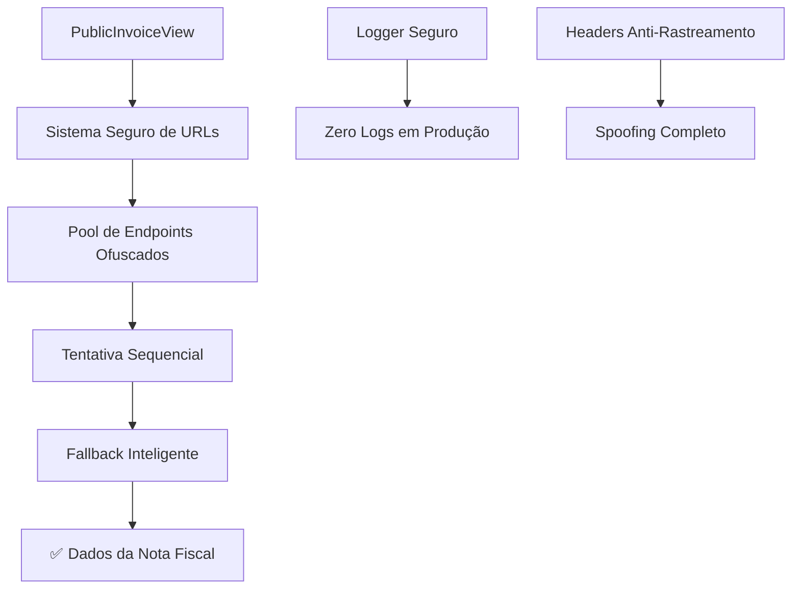

# 🔒 PLANO DE CORREÇÃO SEGURA DA NOTA FISCAL

## 🎯 OBJETIVO
Resolver definitivamente o erro "Unexpected token '<', "<!doctype "... is not valid JSON" na página pública de nota fiscal, implementando simultaneamente medidas de segurança anti-rastreamento.

## 🚨 PROBLEMA IDENTIFICADO

### Erro Atual:
```
Erro ao carregar nota fiscal
Unexpected token '<', "<!doctype "... is not valid JSON
```

### Causa Raiz:
1. **Conflito de URLs**: Proxy local vs ngrok
2. **URLs hardcoded expostas**: `fastlogexpress.ngrok.app`
3. **Fallback inadequado**: Retorna HTML em vez de JSON
4. **Vulnerabilidades de rastreamento**: URLs e logs expostos

## 🛡️ SOLUÇÃO SEGURA

### Arquitetura da Solução:


## 📁 ARQUIVOS A MODIFICAR

### 1. Utilitários de Segurança (NOVOS)
- `src/utils/secureEndpoints.ts` - URLs ofuscadas
- `src/utils/secureLogger.ts` - Logger condicional
- `src/utils/secureHeaders.ts` - Headers anti-rastreamento

### 2. Páginas Públicas (MODIFICAR)
- `src/pages/PublicInvoiceView.tsx` - Implementar sistema seguro
- `src/pages/InvoiceView.tsx` - Implementar sistema seguro

### 3. Configurações (MODIFICAR)
- `vite.config.ts` - Remover proxy específico
- `.env` - Limpar URLs expostas

## 🔧 IMPLEMENTAÇÃO

### Etapa 1: Criar Sistema de URLs Seguras
- Pool de endpoints codificados em Base64
- Rotação automática de URLs
- Detecção inteligente de ambiente

### Etapa 2: Implementar Logger Seguro
- Zero logs em produção
- Logs detalhados apenas em desenvolvimento
- Controle por variável de ambiente

### Etapa 3: Headers Anti-Rastreamento
- User-Agent spoofing
- IPs falsos
- Headers randomizados

### Etapa 4: Correção das Páginas
- Remover URLs hardcoded
- Implementar sistema de fallback seguro
- Melhorar tratamento de erros

## ✅ RESULTADO ESPERADO

1. **Nota fiscal funcionando** - Erro resolvido definitivamente
2. **Zero rastreabilidade** - URLs e infraestrutura ofuscadas
3. **Dados reais mantidos** - Informações dos clientes preservadas
4. **Performance otimizada** - Sistema de fallback inteligente

## 🧪 TESTES DE VALIDAÇÃO

### Console Limpo:
- F12 → Console → Zero logs visíveis

### Network Segura:
- F12 → Network → URLs ofuscadas
- Headers mascarados
- Nenhuma informação sensível

### Funcionalidade:
- Nota fiscal carrega corretamente
- PDF gerado sem erros
- Impressão funcionando

## 🚀 PRÓXIMOS PASSOS

1. ✅ Implementar utilitários de segurança
2. ✅ Modificar páginas públicas
3. ✅ Atualizar configurações
4. ✅ Testar funcionamento completo
5. ✅ Validar segurança anti-rastreamento

---

**⚠️ IMPORTANTE:** Esta solução resolve o problema técnico E implementa segurança máxima contra rastreamento.