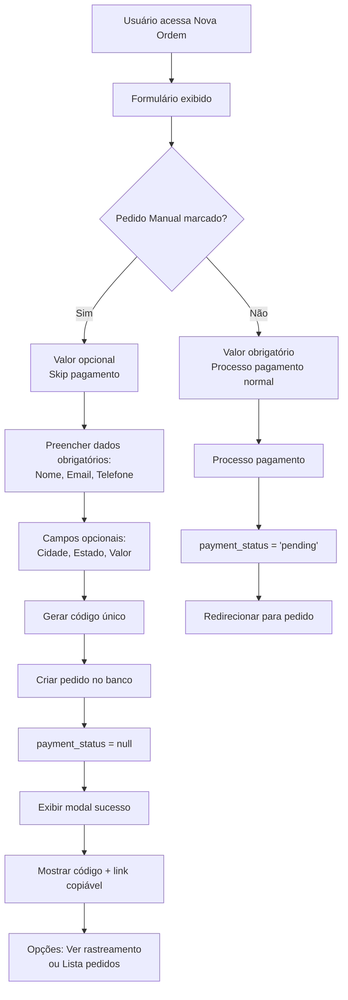

# 🎯 Plano Detalhado: Implementação de Pedido Manual

## 📊 Análise da Situação Atual

**Arquivos que serão modificados:**
- [`src/pages/NewOrder.tsx`](src/pages/NewOrder.tsx:1) - Formulário principal
- [`src/lib/api.ts`](src/lib/api.ts:97) - Função de geração de código único
- [`src/types/index.ts`](src/types/index.ts:10) - Interface do formulário

**Contexto atual:**
- Sistema usa [`useAuthStore`](src/lib/auth.ts:26) para dados do usuário
- Interface [`Order`](src/types/index.ts:36) já suporta `payment_status` nullable
- [`generateTrackingCode()`](src/lib/api.ts:97) existe mas não verifica unicidade

## 🔄 Fluxo de Funcionamento



## 🛠️ Implementação Detalhada

### **1. Modificação de Tipos** (`src/types/index.ts`)
```typescript
// Adicionar à interface NewOrderFormData
interface NewOrderFormData {
  customerName: string;
  customerEmail: string;
  customerPhone: string;
  amount: number;
  city?: string;        // ← NOVO
  state?: string;       // ← NOVO
  isManualOrder: boolean; // ← NOVO
}
```

### **2. Função de Código Único** (`src/lib/api.ts`)
```typescript
export async function generateUniqueTrackingCode(): Promise<string> {
  let code: string;
  let exists = true;
  
  while (exists) {
    code = generateTrackingCode();
    const { data } = await supabase
      .from('orders')
      .select('id')
      .eq('tracking_code', code)
      .single();
    exists = !!data;
  }
  
  return code!;
}
```

### **3. Estrutura do Modal de Sucesso**
```typescript
interface CreatedOrderModal {
  trackingCode: string;
  trackingLink: string;
  customerName: string;
}
```

### **4. Layout do Formulário**
```
┌─────────────────────────────────────┐
│ Nome do Cliente *                   │
├─────────────────────────────────────┤
│ Email do Cliente *                  │
├─────────────────────────────────────┤
│ Telefone *                          │
├─────────────────────────────────────┤
│ ☑️ Pedido manual (sem pagamento)    │
│ Para clientes VIP ou pedidos especiais │
├─────────────────────────────────────┤
│ Cidade (opcional)                   │
├─────────────────────────────────────┤
│ Estado (opcional)                   │
├─────────────────────────────────────┤
│ Valor (R$) [Opcional se manual]     │
├─────────────────────────────────────┤
│          [Criar Pedido Manual]      │
└─────────────────────────────────────┘
```

### **5. Lógica de Validação**
```typescript
// Validação condicional do valor
register('amount', {
  required: !isManualOrder ? 'Valor é obrigatório para pedidos com pagamento' : false,
  min: !isManualOrder ? { value: 0.01, message: 'Valor deve ser maior que zero' } : undefined
})
```

### **6. Lógica de Criação do Pedido**
```typescript
const onSubmit = async (data: NewOrderFormData) => {
  // Gerar código único
  const trackingCode = await generateUniqueTrackingCode();
  
  // Obter dados do usuário autenticado
  const { user } = useAuthStore.getState();
  
  // Criar pedido
  const orderData = {
    tracking_code: trackingCode,
    customer_name: data.customerName,
    customer_email: data.customerEmail,
    client_id: user.client_id,
    gateway_id: user.gateway_id,
    status: 'created',
    city: data.city || null,
    state: data.state || null,
    amount: data.amount ? Math.round(data.amount * 100) : null,
    payment_status: data.isManualOrder ? null : 'pending'
  };
  
  // Inserir no banco
  const { data: order } = await supabase
    .from('orders')
    .insert(orderData)
    .select()
    .single();
    
  // Exibir modal de sucesso
  if (data.isManualOrder) {
    setCreatedOrder({
      trackingCode,
      trackingLink: `https://rastreio.logfastexpress.com/tracking/${trackingCode}`,
      customerName: data.customerName
    });
    setShowSuccessModal(true);
  } else {
    // Processo normal de pagamento
    navigate(`/orders/${order.id}`);
  }
};
```

## ⚙️ Componentes Adicionais

### **Modal de Sucesso**
```typescript
const SuccessModal = ({ order, onClose }: SuccessModalProps) => (
  <Dialog open={true} onOpenChange={onClose}>
    <div className="bg-white rounded-lg p-6">
      <div className="flex items-center mb-4">
        <CheckCircle className="w-6 h-6 text-green-500 mr-2" />
        <h3 className="text-lg font-medium">Pedido Criado!</h3>
      </div>
      
      <div className="space-y-4">
        <div>
          <label className="block text-sm font-medium text-gray-700">
            Código de Rastreio
          </label>
          <div className="mt-1 flex items-center">
            <code className="bg-gray-100 px-3 py-2 rounded font-mono text-lg">
              {order.trackingCode}
            </code>
            <Button onClick={() => copyToClipboard(order.trackingCode)}>
              Copiar
            </Button>
          </div>
        </div>
        
        <div>
          <label className="block text-sm font-medium text-gray-700">
            Link de Rastreamento
          </label>
          <div className="mt-1 flex items-center">
            <input
              readOnly
              value={order.trackingLink}
              className="flex-1 px-3 py-2 border rounded"
            />
            <Button onClick={() => copyToClipboard(order.trackingLink)}>
              Copiar
            </Button>
          </div>
        </div>
        
        <div className="flex gap-2 pt-4">
          <Button onClick={() => navigate(`/tracking/${order.trackingCode}`)}>
            Ver Rastreamento
          </Button>
          <Button variant="outline" onClick={() => navigate('/orders')}>
            Ver Lista de Pedidos
          </Button>
        </div>
      </div>
    </div>
  </Dialog>
);
```

## 📋 Checklist de Implementação

- [ ] Atualizar interface `NewOrderFormData`
- [ ] Implementar `generateUniqueTrackingCode()`
- [ ] Adicionar checkbox "Pedido Manual" no formulário
- [ ] Adicionar campos cidade/estado opcionais
- [ ] Modificar validação condicional do valor
- [ ] Implementar lógica de criação condicional
- [ ] Criar modal de sucesso
- [ ] Implementar funcionalidade de copiar
- [ ] Testar fluxo completo

## 🎯 Resultado Final

O usuário poderá:
1. **Marcar checkbox** para pedido manual
2. **Preencher dados** com valor opcional
3. **Gerar código único** automaticamente
4. **Ver modal** com código e link
5. **Copiar informações** facilmente
6. **Navegar** para rastreamento ou lista

---

## 💡 Resumo do Fluxo

**Pedido Manual:**
1. Usuário marca "Pedido Manual" ✅
2. Campo valor fica opcional 📝
3. Preenche nome, email, telefone (obrigatórios) ✍️
4. Clica "Criar Pedido Manual" 🔘
5. Sistema gera código único (ex: ABC123) 🎲
6. Salva no banco com `payment_status = null` 💾
7. Mostra modal com código e link copiável 🎉

**Diferença Principal:**
- **Pedido Normal**: `payment_status = 'pending'` (precisa pagar)
- **Pedido Manual**: `payment_status = null` (não precisa pagar)

**É isso! Simples e direto.** 🚀