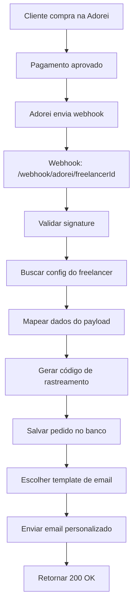

# Plano de Integração - Checkouts Adorei para Freelancers

## Visão Geral
Implementar sistema que permite freelancers configurarem checkout da Adorei com seus domínios personalizados e templates de email customizados.

## Fluxo de Funcionamento



## Sistema de Domínios

### Para Freelancers:
- **Seleção:** Escolher APENAS entre seus próprios domínios já verificados
- **Solicitação:** Solicitar novos domínios via formulário no painel
- **Status:** Visualizar status das solicitações (pendente, aprovado, rejeitado)
- **Isolamento:** Cada usuário só vê e usa seus próprios domínios

### Para Administradores:
- **Verificação:** Gerenciar solicitações de novos domínios
- **Configuração:** Adicionar domínios verificados no Resend
- **Atribuição:** Domínios são sempre vinculados ao usuário solicitante
- **Isolamento:** Garantir que domínios não sejam compartilhados entre usuários

## Estrutura de Dados

### Tabela: freelancer_checkout_configs
```sql
CREATE TABLE freelancer_checkout_configs (
    id UUID PRIMARY KEY DEFAULT gen_random_uuid(),
    user_id UUID REFERENCES auth.users(id) NOT NULL,
    checkout_type VARCHAR(20) DEFAULT 'adorei',
    
    -- Configurações do checkout
    checkout_config JSONB NOT NULL,
    webhook_secret VARCHAR(255),
    
    -- Email personalizado
    email_domain_id UUID REFERENCES email_domains(id),
    email_template_type VARCHAR(50) DEFAULT 'tracking',
    custom_email_template TEXT,
    
    -- Configurações de remetente
    from_name VARCHAR(100),
    from_email VARCHAR(100),
    reply_to_email VARCHAR(100),
    
    is_active BOOLEAN DEFAULT true,
    created_at TIMESTAMP WITH TIME ZONE DEFAULT NOW(),
    updated_at TIMESTAMP WITH TIME ZONE DEFAULT NOW()
);
```
### Tabela: domain_requests (Nova)
```sql
CREATE TABLE domain_requests (
    id UUID PRIMARY KEY DEFAULT gen_random_uuid(),
    user_id UUID REFERENCES auth.users(id) NOT NULL,
    domain_name VARCHAR(255) NOT NULL,
    business_name VARCHAR(255),
    business_description TEXT,
    reason TEXT,
    status VARCHAR(20) DEFAULT 'pending', -- pending, approved, rejected
    admin_notes TEXT,
    approved_by UUID REFERENCES auth.users(id),
    created_at TIMESTAMP WITH TIME ZONE DEFAULT NOW(),
    updated_at TIMESTAMP WITH TIME ZONE DEFAULT NOW(),
    
    -- Garantir que cada usuário só pode solicitar um domínio específico uma vez
    UNIQUE(user_id, domain_name)
);
```

### Modificação na Tabela: email_domains (Existente)
```sql
-- Adicionar campo owner_id se não existir
ALTER TABLE email_domains ADD COLUMN IF NOT EXISTS owner_id UUID REFERENCES auth.users(id);

-- Índice para performance nas consultas por usuário
CREATE INDEX IF NOT EXISTS idx_email_domains_owner ON email_domains(owner_id, is_active);
```
```

## Componentes da Interface

### FreelancerDashboard - Nova Seção
```typescript
// Nova seção: "Configurações de Checkout"
<Card>
  <CardHeader>Configurações de Checkout</CardHeader>
  <CardContent>
    - Seletor de checkout (Adorei por agora)
    - Configuração de webhook
    - Seletor de domínio de email
    - Botão "Solicitar Novo Domínio"
    - Configuração de template
  </CardContent>
</Card>
```

### Novo Componente: FreelancerCheckoutConfig
```typescript
interface CheckoutConfigProps {
  userId: string;
  onConfigUpdate: () => void;
}

// Funcionalidades:
- Formulário de configuração do checkout Adorei
- Seletor de domínios disponíveis
- Editor de template personalizado
- Preview do template
- Teste de configuração
```

## Mapeamento de Dados Adorei

### Payload Adorei → Sistema Interno
```javascript
const mapAdoreiPayload = (payload) => ({
  // Cliente
  customer_name: `${payload.resource.customer.first_name} ${payload.resource.customer.last_name}`,
  customer_email: payload.resource.customer.email,
  customer_phone: payload.resource.customer.phone,
  customer_cpf: payload.resource.customer.doc,
  
  // Pedido
  payment_id: payload.resource.number.toString(),
  amount: Math.round(payload.resource.value_total * 100), // Converter para centavos
  
  // Endereço
  city: payload.resource.address.city,
  state: payload.resource.address.uf,
  address_full: `${payload.resource.address.street}, ${payload.resource.address.number}`,
  zipcode: payload.resource.address.zipcode,
  
  // Rastreamento
  tracking_info: payload.resource.tracking || null
});
```

## Templates de Email

### 1. Template Padrão (Rastreamento)
- Usar `TrackingEmail.tsx` existente
- Aplicar configurações personalizadas de remetente
- Manter visual da transportadora

### 2. Template Personalizado
- Editor HTML no painel do freelancer
- Variáveis disponíveis: {customer_name}, {tracking_code}, {order_id}
- Preview em tempo real
- Validação de HTML

### 3. Template de Confirmação de Pedido (Futuro)
- Focado em confirmação de compra
- Informações do produto
- Dados de entrega

## Webhook Handler da Adorei

### Endpoint: `/webhook/adorei/:freelancerId`
```typescript
export const adoreiWebhookHandler = async (req: Request, res: Response) => {
  const freelancerId = req.params.freelancerId;
  
  // 1. Buscar configuração do freelancer
  // 2. Validar signature do webhook
  // 3. Verificar se evento é 'order.status.approved'
  // 4. Mapear dados do payload
  // 5. Enfileirar para processamento
  // 6. Retornar 200 OK
};
```

### Worker: adorei-webhook.worker.ts
```typescript
// Funcionalidades:
- Processar webhook da Adorei
- Gerar código de rastreamento
- Salvar pedido com configuração personalizada
- Enviar email com template escolhido
- Usar domínio personalizado do freelancer
```

## Sistema de Solicitação de Domínios

### Interface para Freelancer
```typescript
// Modal: SolicitarDominio
<form onSubmit={handleSolicitarDominio}>
  <input name="domain_name" placeholder="meudominio.com" />
  <input name="business_name" placeholder="Nome da empresa" />
  <textarea name="reason" placeholder="Motivo da solicitação" />
  <button type="submit">Solicitar Domínio</button>
</form>
```

### Painel Admin
```typescript
// Página: AdminDomainRequests
- Lista de solicitações pendentes
- Botões: Aprovar / Rejeitar
- Campo para notas administrativas
- Integração com sistema de email_domains
```

## Fluxo de Configuração

1. **Freelancer:** Acessa "Configurações de Checkout"
2. **Escolha:** Seleciona checkout Adorei
3. **Webhook:** Recebe URL: `/webhook/adorei/{seu-id}`
4. **Domínio:** Escolhe domínio disponível ou solicita novo
5. **Template:** Escolhe padrão ou personaliza
6. **Teste:** Envia webhook de teste
7. **Ativação:** Configura na Adorei

## Validações de Segurança

### Webhook da Adorei
- Validação de signature usando webhook_secret
- Verificação de timestamp para evitar replay attacks
- Rate limiting por freelancer

### Configurações
- Validação de domínio de email
- Sanitização de template HTML personalizado
- Verificação de permissões do usuário

## Considerações Técnicas

### Performance
- Cache de configurações de freelancer
- Processamento assíncrono via workers
- Rate limiting nos webhooks

### Monitoramento
- Logs detalhados de webhook processing
- Métricas de emails enviados por freelancer
- Alertas para falhas de configuração

### Escalabilidade
- Suporte a múltiplos checkouts (preparação futura)
- Sistema flexível de templates
- API extensível para novos gateways