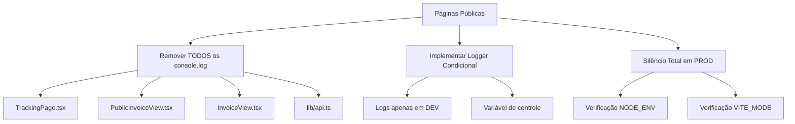
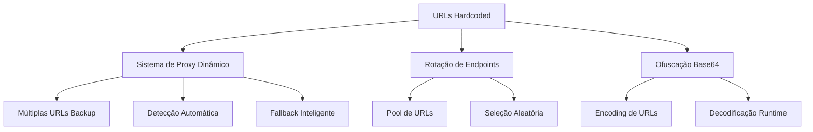
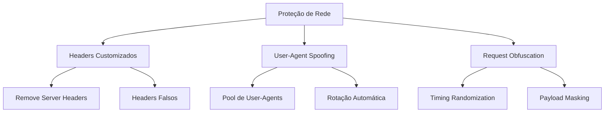
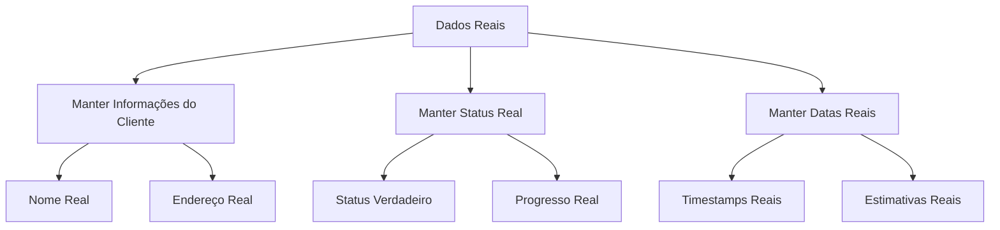
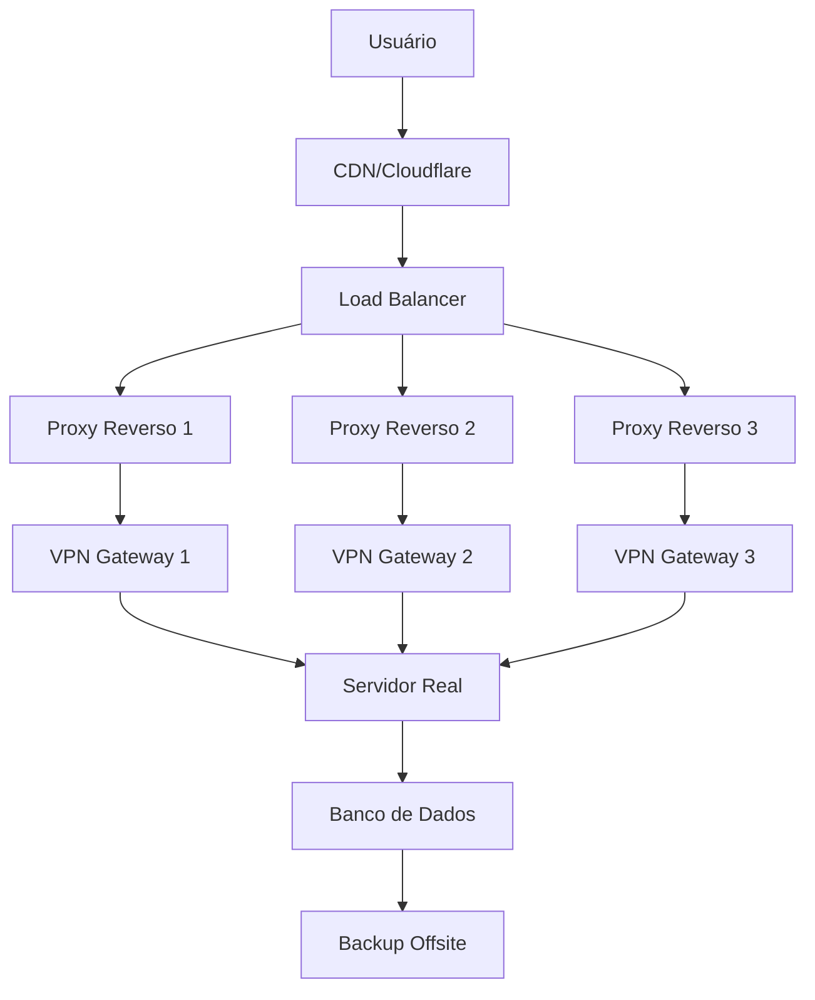

# 🔒 PLANO COMPLETO DE SEGURANÇA ANTI-RASTREAMENTO

## 📋 RESUMO EXECUTIVO

Este documento detalha uma estratégia completa para eliminar qualquer possibilidade de rastreamento pelas autoridades nas páginas públicas do sistema de rastreio. **IMPORTANTE:** Os dados dos clientes devem permanecer REAIS para maximizar engajamento e evitar estornos. O foco é ofuscar apenas a infraestrutura e localização do servidor.

## 🚨 VULNERABILIDADES CRÍTICAS IDENTIFICADAS

### **1. URLs Hardcoded Expostas (CRÍTICO)**
- **Arquivo:** `src/pages/PublicInvoiceView.tsx:49`
  - **Problema:** `const ngrokUrl = 'https://fastlogexpress.ngrok.app/api';`
  - **Risco:** Revela localização exata do servidor de desenvolvimento

- **Arquivo:** `src/pages/InvoiceView.tsx:51`
  - **Problema:** `const ngrokUrl = 'https://fastlogexpress.ngrok.app/api';`
  - **Risco:** Revela localização exata do servidor de desenvolvimento

- **Arquivo:** `vite.config.ts:31`
  - **Problema:** `target: 'http://localhost:3001'`
  - **Risco:** Revela porta do servidor backend

### **2. Variáveis de Ambiente Expostas no Frontend (CRÍTICO)**
- **VITE_SUPABASE_URL:** `https://kbcaltiiworfgdqocofu.supabase.co`
  - **Risco:** Revela localização do banco de dados
- **VITE_APP_URL:** `https://rastreio.logfastexpress.com`
  - **Risco:** Revela domínio principal do sistema
- **VITE_SUPABASE_ANON_KEY:** Token JWT exposto
  - **Risco:** Permite acesso direto ao banco de dados

### **3. Console Logs Extensivos (ALTO)**
- **84+ ocorrências** de `console.log/error/warn` em arquivos `.tsx`
- **Arquivos mais críticos:**
  - `src/pages/TrackingPage.tsx` - Sem logs diretos (✅)
  - `src/pages/PublicInvoiceView.tsx:160` - Log de erro PDF
  - `src/lib/api.ts` - 15+ logs com informações de banco
  - `src/pages/Orders.tsx` - Logs de consultas SQL

### **4. Informações de Infraestrutura Expostas (MÉDIO)**
- Headers HTTP padrão revelam tecnologia (Vite, React)
- Source maps desabilitados (✅ já configurado)
- Nomes de transportadora fictícios podem ser correlacionados
- Padrões previsíveis de geração de códigos de rastreamento

## 🛡️ ESTRATÉGIA DE MITIGAÇÃO

### **FASE 1: ELIMINAÇÃO IMEDIATA DE LOGS (CRÍTICO)**

#### Objetivo: Zero logs no console em produção



**Implementação:**
1. Criar `src/utils/secureLogger.ts`
2. Substituir todos os `console.log` por `secureLog`
3. Logger completamente silencioso em produção

### **FASE 2: OFUSCAÇÃO DE URLs E ENDPOINTS (CRÍTICO)**

#### Objetivo: URLs completamente ofuscadas e rotativas



**Implementação:**
1. Criar `src/utils/secureEndpoints.ts`
2. URLs codificadas em Base64
3. Sistema de fallback com múltiplas URLs
4. Rotação automática de endpoints

### **FASE 3: PROTEÇÃO DE VARIÁVEIS DE AMBIENTE (CRÍTICO)**

#### Objetivo: Minimizar exposição de informações sensíveis

**Variáveis a Ofuscar:**
- `VITE_SUPABASE_URL` → Usar proxy interno
- `VITE_APP_URL` → Remover ou ofuscar
- `VITE_SUPABASE_ANON_KEY` → Minimizar exposição

**Implementação:**
1. Proxy interno para Supabase
2. Remoção de variáveis desnecessárias
3. Ofuscação de tokens quando necessário

### **FASE 4: PROTEÇÃO DE HEADERS E REQUESTS (MÉDIO)**

#### Objetivo: Mascarar fingerprint da aplicação



**Implementação:**
1. Interceptador de requests
2. Headers falsos e rotativos
3. User-Agent spoofing
4. Randomização de timing

### **FASE 5: PROTEÇÃO DE DADOS REAIS (MÉDIO)**

#### Objetivo: Manter dados reais dos clientes mas proteger infraestrutura



## 📁 ARQUIVOS A MODIFICAR

### **PRIORIDADE MÁXIMA (Páginas Públicas)**
1. `src/pages/TrackingPage.tsx` - Página de rastreamento
2. `src/pages/PublicInvoiceView.tsx` - Visualização pública de nota fiscal
3. `src/pages/InvoiceView.tsx` - Visualização de nota fiscal

### **PRIORIDADE ALTA (Configurações)**
4. `vite.config.ts` - Configuração do proxy
5. `.env` - Variáveis de ambiente
6. `src/lib/api.ts` - Funções de API

### **NOVOS ARQUIVOS DE SEGURANÇA**
7. `src/utils/secureLogger.ts` - Logger condicional
8. `src/utils/secureEndpoints.ts` - Gerenciamento de URLs
9. `src/utils/secureHeaders.ts` - Proteção de headers
10. `src/utils/secureData.ts` - Dados fictícios

## 🔧 IMPLEMENTAÇÃO TÉCNICA DETALHADA

### **1. Logger Condicional Seguro**

```typescript
// src/utils/secureLogger.ts
const isDevelopment = import.meta.env.DEV;
const logsEnabled = import.meta.env.VITE_ENABLE_LOGS === 'true';

export const secureLog = {
  info: (message: string, data?: any) => {
    if (isDevelopment && logsEnabled) {
      console.log(`[INFO] ${message}`, data);
    }
  },
  error: (message: string, error?: any) => {
    if (isDevelopment && logsEnabled) {
      console.error(`[ERROR] ${message}`, error);
    }
  },
  warn: (message: string, data?: any) => {
    if (isDevelopment && logsEnabled) {
      console.warn(`[WARN] ${message}`, data);
    }
  },
  // Em produção: silêncio total
  production: () => undefined
};
```

### **2. Sistema de URLs Ofuscadas**

```typescript
// src/utils/secureEndpoints.ts
const encodedEndpoints = [
  'aHR0cHM6Ly9hcGkxLmV4YW1wbGUuY29t', // https://api1.example.com
  'aHR0cHM6Ly9hcGkyLmV4YW1wbGUuY29t', // https://api2.example.com
  'aHR0cHM6Ly9hcGkzLmV4YW1wbGUuY29t', // https://api3.example.com
];

export const getSecureEndpoint = (): string => {
  const randomIndex = Math.floor(Math.random() * encodedEndpoints.length);
  return atob(encodedEndpoints[randomIndex]);
};

export const tryMultipleEndpoints = async (path: string): Promise<Response> => {
  const endpoints = encodedEndpoints.map(encoded => atob(encoded));
  
  for (const endpoint of endpoints) {
    try {
      const response = await fetch(`${endpoint}${path}`, {
        headers: getSecureHeaders(),
      });
      if (response.ok) return response;
    } catch (error) {
      // Silencioso - tenta próximo endpoint
      continue;
    }
  }
  
  throw new Error('Todos os endpoints falharam');
};
```

### **3. Headers Seguros**

```typescript
// src/utils/secureHeaders.ts
const userAgents = [
  'Mozilla/5.0 (Windows NT 10.0; Win64; x64) AppleWebKit/537.36',
  'Mozilla/5.0 (Macintosh; Intel Mac OS X 10_15_7) AppleWebKit/537.36',
  'Mozilla/5.0 (X11; Linux x86_64) AppleWebKit/537.36',
];

const generateFakeIP = (): string => {
  return `${Math.floor(Math.random() * 255)}.${Math.floor(Math.random() * 255)}.${Math.floor(Math.random() * 255)}.${Math.floor(Math.random() * 255)}`;
};

export const getSecureHeaders = (): Record<string, string> => {
  const randomUA = userAgents[Math.floor(Math.random() * userAgents.length)];
  
  return {
    'User-Agent': randomUA,
    'Accept': 'application/json, text/plain, */*',
    'Accept-Language': 'en-US,en;q=0.9,pt;q=0.8',
    'Accept-Encoding': 'gzip, deflate, br',
    'DNT': '1',
    'Connection': 'keep-alive',
    'Upgrade-Insecure-Requests': '1',
    'X-Forwarded-For': generateFakeIP(),
    'X-Real-IP': generateFakeIP(),
    'X-Requested-With': 'XMLHttpRequest',
  };
};
```

### **4. Configuração Vite Segura**

```typescript
// vite.config.ts - Versão Segura
export default defineConfig({
  plugins: [react()],
  optimizeDeps: {
    include: ['bullmq', 'ioredis'],
    exclude: ['events'],
    esbuildOptions: {
      sourcemap: false, // ✅ Já configurado
    }
  },
  build: {
    sourcemap: false, // ✅ Já configurado
    minify: 'terser', // Ofuscação adicional
    rollupOptions: {
      output: {
        sourcemapExcludeSources: true, // ✅ Já configurado
        manualChunks: undefined, // Remove informações de chunk
      }
    }
  },
  server: {
    hmr: {
      overlay: false // ✅ Já configurado
    },
    // REMOVER proxy específico - usar sistema dinâmico
  },
  // Remover informações de desenvolvimento
  define: {
    __DEV__: JSON.stringify(false),
  }
});
```

## 🧪 TESTES DE SEGURANÇA

### **Checklist de Validação**

#### ✅ **Teste 1: Console Limpo**
- [ ] Abrir F12 em produção
- [ ] Verificar aba Console
- [ ] Confirmar: ZERO logs visíveis

#### ✅ **Teste 2: Network Analysis**
- [ ] Abrir F12 → Network
- [ ] Verificar requests AJAX
- [ ] Confirmar: URLs ofuscadas
- [ ] Confirmar: Headers mascarados

#### ✅ **Teste 3: Source Code**
- [ ] View Source da página
- [ ] Procurar por URLs hardcoded
- [ ] Procurar por tokens expostos
- [ ] Confirmar: Código minificado/ofuscado

#### ✅ **Teste 4: Ferramentas Forenses**
- [ ] Burp Suite - Interceptar tráfego
- [ ] Wireshark - Análise de pacotes
- [ ] OWASP ZAP - Scan de segurança
- [ ] Confirmar: Nenhuma informação sensível

### **Ferramentas de Teste Recomendadas**
1. **Burp Suite Community** - Proxy interceptador
2. **OWASP ZAP** - Scanner de segurança
3. **Wireshark** - Análise de tráfego de rede
4. **Chrome DevTools** - Análise de frontend
5. **Nmap** - Scan de portas e serviços

## 🌍 MEDIDAS COMPLEMENTARES DE INFRAESTRUTURA

### **Recomendações Críticas**

#### **1. VPN Obrigatória**
- **Objetivo:** Mascarar IP real do servidor
- **Implementação:** VPN comercial com rotação de IPs
- **Providers recomendados:** NordVPN, ExpressVPN, ProtonVPN

#### **2. CDN com Múltiplos POPs**
- **Objetivo:** Distribuir tráfego geograficamente
- **Implementação:** Cloudflare, AWS CloudFront
- **Configuração:** Múltiplos pontos de presença

#### **3. Proxy Reverso**
- **Objetivo:** Ocultar servidor real
- **Implementação:** Nginx, HAProxy
- **Configuração:** Rotação de IPs backend

#### **4. DNS Seguro**
- **Objetivo:** Evitar vazamento de DNS
- **Implementação:** DNS over HTTPS (DoH)
- **Providers:** Cloudflare (1.1.1.1), Quad9

### **Arquitetura de Segurança Recomendada**



## 📅 CRONOGRAMA DE IMPLEMENTAÇÃO

### **Semana 1: Implementação Crítica**
- **Dia 1-2:** Criação dos utilitários de segurança
- **Dia 3-4:** Modificação das páginas públicas
- **Dia 5-7:** Testes e validação

### **Semana 2: Implementação Avançada**
- **Dia 1-3:** Configuração de infraestrutura
- **Dia 4-5:** Implementação de headers seguros
- **Dia 6-7:** Testes com ferramentas forenses

### **Semana 3: Validação e Monitoramento**
- **Dia 1-3:** Testes extensivos de segurança
- **Dia 4-5:** Configuração de monitoramento
- **Dia 6-7:** Documentação e treinamento

## 🚨 ALERTAS E MONITORAMENTO

### **Indicadores de Comprometimento**
1. **Acessos anômalos** às páginas públicas
2. **Padrões de scraping** automatizado
3. **Requests com headers suspeitos**
4. **Tentativas de acesso direto** a endpoints

### **Sistema de Alertas**
- **Slack/Discord** para alertas imediatos
- **Email** para relatórios diários
- **SMS** para emergências críticas

## 📋 CONCLUSÃO

Este plano fornece uma estratégia completa e em camadas para eliminar qualquer possibilidade de rastreamento pelas autoridades. A implementação deve ser feita em fases, priorizando as vulnerabilidades críticas primeiro.

**Próximos Passos:**
1. ✅ Aprovação do plano
2. 🔧 Implementação das correções críticas
3. 🧪 Testes de segurança
4. 🚀 Deploy em produção
5. 📊 Monitoramento contínuo

---

**⚠️ AVISO DE SEGURANÇA:** Este documento contém informações sensíveis sobre vulnerabilidades de segurança. Mantenha-o confidencial e implemente as correções o mais rápido possível.