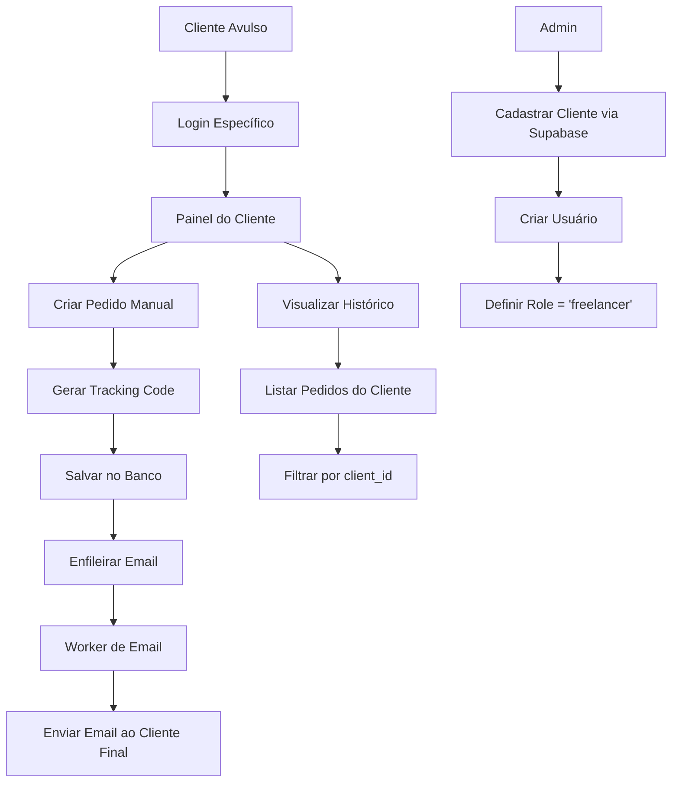
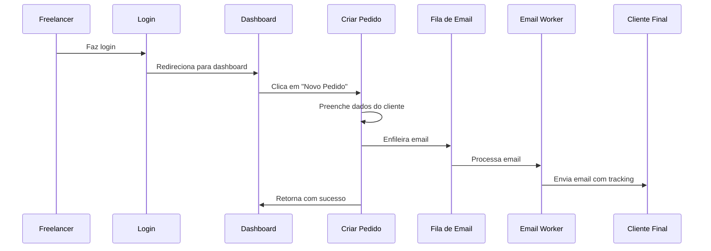
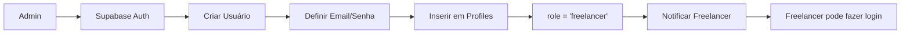

# 📋 **PLANO DETALHADO: Sistema de Clientes Avulsos (Freelancers)**

## 🎯 **Resumo dos Requisitos**

### **Contexto**
O sistema de rastreamento já possui funcionalidade de criação de pedidos manuais no painel administrativo. Agora precisamos criar um sistema para clientes avulsos (freelancers) que permita:

- **Clientes alvo**: João (joao@example.com), Lucas (lucas@example.com) e outros freelancers
- **Cadastro**: Apenas administrador via Supabase
- **Funcionalidades**: Criar pedidos manuais + visualizar histórico próprio
- **Emails**: Enfileiramento automático usando sistema de filas existente
- **Separação**: Cada cliente vê apenas seus próprios pedidos
- **Isolamento**: Dados completamente separados por cliente

## 🏗️ **Arquitetura do Sistema**

### **Diagrama de Fluxo Principal**


### **Diagrama de Sequência - Criação de Pedido**


## 🔧 **Implementação Detalhada**

### **1. Modificações no Banco de Dados**

#### **1.1 Novo Role para Freelancers**
```sql
-- Adicionar novo tipo de usuário
ALTER TYPE app_role ADD VALUE 'freelancer';
```

#### **1.2 Tabela Adicional (Opcional)**
```sql
-- Criar tabela para configurações específicas de freelancers
CREATE TABLE freelancer_settings (
    id UUID PRIMARY KEY DEFAULT gen_random_uuid(),
    user_id UUID REFERENCES auth.users(id),
    business_name TEXT,
    contact_info JSONB,
    created_at TIMESTAMP DEFAULT now()
);
```

#### **1.3 Políticas RLS (Row Level Security)**
```sql
-- Freelancers só veem seus próprios pedidos
CREATE POLICY "Freelancers can only see their own orders" ON orders
    FOR SELECT USING (
        auth.uid() IN (
            SELECT id FROM profiles 
            WHERE profiles.id = auth.uid() 
            AND profiles.role = 'freelancer'
        )
        AND created_by = auth.uid()
    );

-- Freelancers só podem criar pedidos
CREATE POLICY "Freelancers can create orders" ON orders
    FOR INSERT WITH CHECK (
        auth.uid() IN (
            SELECT id FROM profiles 
            WHERE profiles.id = auth.uid() 
            AND profiles.role = 'freelancer'
        )
        AND created_by = auth.uid()
    );
```

### **2. Atualização do Sistema de Autenticação**

#### **2.1 Modificações em `src/types/index.ts`**
```typescript
// Adicionar novo role
export interface Profile {
  id: string;
  role: 'admin' | 'gateway_user' | 'freelancer'; // Adicionar 'freelancer'
  client_id?: string | null;
  gateway_id?: string | null;
  full_name?: string | null;
  updated_at?: string | null;
}
```

#### **2.2 Atualizações em `src/lib/auth.ts`**
```typescript
// Adicionar verificação para freelancer
export function useAuth() {
  // ... código existente ...
  
  const isAdmin = user?.role === 'admin';
  const isGatewayUser = user?.role === 'gateway_user';
  const isFreelancer = user?.role === 'freelancer'; // NOVO

  return {
    // ... propriedades existentes ...
    isFreelancer, // NOVO
  };
}
```

#### **2.3 Modificações em `src/components/ProtectedRoute.tsx`**
```typescript
// Incluir rotas para freelancers
const allowedRoles = ['admin', 'gateway_user', 'freelancer'];
```

### **3. Novas Páginas e Componentes**

#### **3.1 Páginas Novas**
- **`src/pages/FreelancerDashboard.tsx`** - Dashboard principal do freelancer
- **`src/pages/FreelancerOrders.tsx`** - Histórico de pedidos do freelancer
- **`src/pages/FreelancerNewOrder.tsx`** - Criar pedido manual (versão simplificada)

#### **3.2 Componentes Novos**
- **`src/components/FreelancerLayout.tsx`** - Layout específico para freelancers
- **`src/components/ui/FreelancerOrderModal.tsx`** - Modal para criar pedidos
- **`src/components/FreelancerOrderHistory.tsx`** - Tabela de histórico

#### **3.3 Estrutura do FreelancerLayout**
```typescript
// Navegação simplificada para freelancers
const navigation = [
  { name: 'Dashboard', href: '/freelancer/dashboard', icon: Home },
  { name: 'Meus Pedidos', href: '/freelancer/orders', icon: Package },
  { name: 'Criar Pedido', href: '/freelancer/new-order', icon: Plus },
];
```

### **4. Rotas e Navegação**

#### **4.1 Novas Rotas no App.tsx**
```typescript
// Adicionar rotas para freelancers
<Route path="/freelancer" element={<ProtectedRoute allowedRoles={['freelancer']} />}>
  <Route path="dashboard" element={<FreelancerDashboard />} />
  <Route path="orders" element={<FreelancerOrders />} />
  <Route path="new-order" element={<FreelancerNewOrder />} />
</Route>
```

#### **4.2 Redirecionamento no `src/components/RoleBasedRedirect.tsx`**
```typescript
// Redirecionar freelancers para seu dashboard
if (user.role === 'freelancer') {
  return <Navigate to="/freelancer/dashboard" replace />;
}
```

### **5. Integração com Sistema de Filas**

#### **5.1 Reutilização do Sistema Existente**
- **Usar `src/lib/queue.ts`**: Função `queueEmail()` existente
- **Usar `src/workers/email.worker.ts`**: Worker de email existente
- **Usar `src/lib/emailService.tsx`**: Serviço de email existente

#### **5.2 Fluxo de Criação de Pedido**
```typescript
// Em FreelancerOrderModal.tsx
const handleSubmit = async (data) => {
  // 1. Criar pedido no banco
  const order = await createOrder(data);
  
  // 2. Enfileirar email
  await queueEmail({
    to: data.customer_email,
    template: 'tracking',
    context: {
      trackingCode: order.tracking_code,
      customerName: data.customer_name,
    }
  });
  
  // 3. Mostrar sucesso
  showSuccessMessage();
};
```

## 🔒 **Segurança e Isolamento de Dados**

### **Princípios de Segurança**
1. **Isolamento total**: Cada freelancer acessa apenas seus dados
2. **RLS no banco**: Políticas garantem separação a nível de BD
3. **Autenticação**: Verificação de role em todas as operações
4. **Autorização**: Middleware para validar permissões

### **Validações de Segurança**
- ✅ Freelancer só vê pedidos que criou
- ✅ Freelancer só pode criar pedidos em seu nome
- ✅ Não pode acessar dados de outros freelancers
- ✅ Não pode acessar funções administrativas

## 🎨 **Interface do Usuário**

### **Dashboard do Freelancer**
```
┌─────────────────────────────────────────────────────────────┐
│                    Dashboard - João                          │
├─────────────────────────────────────────────────────────────┤
│  📊 Estatísticas                                            │
│  ┌─────────────┐ ┌─────────────┐ ┌─────────────┐           │
│  │    Pedidos  │ │   Enviados  │ │    Hoje     │           │
│  │     Total   │ │    Hoje     │ │             │           │
│  │      25     │ │      3      │ │      3      │           │
│  └─────────────┘ └─────────────┘ └─────────────┘           │
│                                                             │
│  🚀 Ações Rápidas                                          │
│  ┌─────────────────────────────────────────────────────────┐ │
│  │        [+ Criar Novo Pedido]                            │ │
│  │        [📋 Ver Todos os Pedidos]                        │ │
│  └─────────────────────────────────────────────────────────┘ │
│                                                             │
│  📦 Últimos Pedidos                                         │
│  ┌─────────────────────────────────────────────────────────┐ │
│  │ Código    │ Cliente      │ Email           │ Status      │ │
│  │ RT001234  │ Maria Silva  │ maria@email.com │ Enviado     │ │
│  │ RT001235  │ João Santos  │ joao@email.com  │ Enviado     │ │
│  └─────────────────────────────────────────────────────────┘ │
└─────────────────────────────────────────────────────────────┘
```

### **Histórico de Pedidos**
```
┌─────────────────────────────────────────────────────────────┐
│                 Meus Pedidos - João                         │
├─────────────────────────────────────────────────────────────┤
│  🔍 Filtros                                                 │
│  Data: [01/01/2025] até [31/01/2025]    [🔍 Filtrar]       │
│                                                             │
│  📋 Lista de Pedidos                                        │
│  ┌─────────────────────────────────────────────────────────┐ │
│  │ Código    │ Cliente      │ Email           │ Data  │ Status │
│  │ RT001234  │ Maria Silva  │ maria@email.com │ 15/01 │ ✅     │
│  │ RT001235  │ João Santos  │ joao@email.com  │ 14/01 │ ✅     │
│  │ RT001236  │ Ana Costa    │ ana@email.com   │ 13/01 │ ✅     │
│  └─────────────────────────────────────────────────────────┘ │
│                                                             │
│  📄 Paginação: [1] [2] [3] ... [10]                        │
└─────────────────────────────────────────────────────────────┘
```

### **Criação de Pedidos**
```
┌─────────────────────────────────────────────────────────────┐
│                   Criar Novo Pedido                         │
├─────────────────────────────────────────────────────────────┤
│  📦 Dados do Cliente                                        │
│  ┌─────────────────────────────────────────────────────────┐ │
│  │ Nome do Cliente *                                       │ │
│  │ [________________________]                              │ │
│  │                                                         │ │
│  │ Email do Cliente *                                      │ │
│  │ [________________________]                              │ │
│  │                                                         │ │
│  │ Cidade (opcional)        Estado (opcional)              │ │
│  │ [____________]           [____]                         │ │
│  │                                                         │ │
│  │ Valor (opcional)                                        │ │
│  │ R$ [________]                                           │ │
│  └─────────────────────────────────────────────────────────┘ │
│                                                             │
│  [Cancelar]                              [Criar Pedido]     │
└─────────────────────────────────────────────────────────────┘
```

## 🔄 **Processo de Cadastro (Manual via Supabase)**

### **Diagrama do Processo**


### **Passos Manuais no Supabase**
1. **Criar usuário** na tabela `auth.users`
2. **Definir email e senha** temporária
3. **Inserir registro** na tabela `profiles`:
   ```sql
   INSERT INTO profiles (id, role, full_name)
   VALUES ('user-uuid', 'freelancer', 'João Silva');
   ```
4. **Notificar freelancer** com credenciais
5. **Freelancer faz login** e pode começar a usar

## 🛠️ **Modificações em Arquivos Existentes**

### **Lista de Arquivos a Modificar**
1. **`src/types/index.ts`** ✏️
   - Adicionar role `'freelancer'` ao tipo Profile

2. **`src/lib/auth.ts`** ✏️
   - Adicionar helper `isFreelancer`
   - Atualizar hook `useAuth()`

3. **`src/components/ProtectedRoute.tsx`** ✏️
   - Incluir rotas para freelancers
   - Adicionar verificação de role

4. **`src/App.tsx`** ✏️
   - Adicionar rotas do freelancer
   - Configurar navegação

5. **`src/components/RoleBasedRedirect.tsx`** ✏️
   - Redirecionar freelancers para dashboard específico

### **Novos Arquivos a Criar**
1. **`src/pages/FreelancerDashboard.tsx`** 🆕
2. **`src/pages/FreelancerOrders.tsx`** 🆕
3. **`src/pages/FreelancerNewOrder.tsx`** 🆕
4. **`src/components/FreelancerLayout.tsx`** 🆕
5. **`src/components/ui/FreelancerOrderModal.tsx`** 🆕
6. **`src/components/FreelancerOrderHistory.tsx`** 🆕

## 📊 **Funcionalidades Específicas**

### **Dashboard do Freelancer**
- ✅ Resumo de pedidos criados (total, hoje, semana)
- ✅ Botão destacado "Criar Novo Pedido"
- ✅ Tabela com últimos 5 pedidos criados
- ✅ Links rápidos para histórico completo
- ✅ Estatísticas básicas de uso

### **Histórico de Pedidos**
- ✅ Tabela responsiva com todos os pedidos
- ✅ Filtros por data (início e fim)
- ✅ Busca por nome do cliente ou email
- ✅ Informações: código, cliente, email, data, status
- ✅ Paginação para grandes volumes
- ✅ Ordenação por data (mais recente primeiro)

### **Criação de Pedidos**
- ✅ Formulário limpo e intuitivo
- ✅ Validação de campos obrigatórios
- ✅ Geração automática de código de rastreamento
- ✅ Enfileiramento automático do email
- ✅ Feedback visual de sucesso/erro
- ✅ Redirecionamento após criação

## 🎯 **Benefícios da Arquitetura**

### **Técnicos**
- ✅ **Reutilização**: Usa sistema de filas existente
- ✅ **Segurança**: Isolamento total via RLS
- ✅ **Escalabilidade**: Pode adicionar quantos freelancers quiser
- ✅ **Manutenibilidade**: Código organizado e separado
- ✅ **Consistência**: Mesmo padrão de UI do sistema atual

### **Negócio**
- ✅ **Simplicidade**: Interface focada nas necessidades do freelancer
- ✅ **Autonomia**: Freelancers trabalham independentemente
- ✅ **Controle**: Admin mantém controle total sobre cadastros
- ✅ **Rastreabilidade**: Cada pedido é rastreável e auditável

## 🚀 **Próximos Passos**

### **Fase 1: Preparação**
1. Criar scripts SQL para alterações no banco
2. Atualizar tipos e interfaces
3. Modificar sistema de autenticação

### **Fase 2: Interface**
1. Criar layout base para freelancers
2. Implementar dashboard principal
3. Criar formulário de novo pedido

### **Fase 3: Funcionalidades**
1. Implementar histórico de pedidos
2. Integrar com sistema de filas
3. Adicionar validações e segurança

### **Fase 4: Testes**
1. Testar isolamento de dados
2. Validar fluxo completo
3. Testar sistema de emails

---

**📝 Documento criado em**: 07/01/2025  
**👤 Arquiteto**: Kilo Code  
**🎯 Objetivo**: Sistema de Clientes Avulsos para Rastreamento