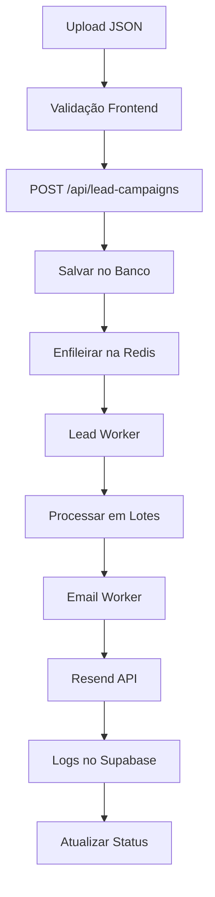

# 🚀 Sistema de Campanha de Leads - Implementação Completa

## 📋 **Funcionalidades Implementadas**

✅ **Interface completa no Dashboard administrativo**  
✅ **Upload drag & drop de arquivos JSON**  
✅ **Configuração personalizada de templates de email**  
✅ **Preview em tempo real do email**  
✅ **Processamento assíncrono via filas (Redis + BullMQ)**  
✅ **Integração com Resend para disparo**  
✅ **Monitoramento e logs detalhados**  
✅ **Suporte para até 10k+ leads simultaneamente**  

---

## 🏗️ **Arquivos Criados/Modificados**

### **Backend**
- [`scripts/create-lead-campaigns-table.sql`](scripts/create-lead-campaigns-table.sql) - Tabela para campanhas
- [`src/routes/leadCampaignRoutes.ts`](src/routes/leadCampaignRoutes.ts) - API endpoints
- [`src/workers/lead.worker.ts`](src/workers/lead.worker.ts) - Worker atualizado com logs
- [`src/webhook-server/index.ts`](src/webhook-server/index.ts) - Rotas registradas

### **Frontend**
- [`src/components/LeadCampaignManager.tsx`](src/components/LeadCampaignManager.tsx) - Componente principal
- [`src/pages/Dashboard.tsx`](src/pages/Dashboard.tsx) - Integração no dashboard

### **Teste**
- [`test-leads-example.json`](test-leads-example.json) - Arquivo de exemplo com 10 leads

---

## 🚀 **Como Usar**

### **1. Configurar Banco de Dados**
```sql
-- Executar o script SQL
\i scripts/create-lead-campaigns-table.sql
```

### **2. Iniciar Serviços**
```bash
# Terminal 1: Webhook Server (API)
npm run dev:webhook

# Terminal 2: Worker de Leads
npm run dev:lead

# Terminal 3: Redis (se não estiver rodando)
redis-server
```

### **3. Usar a Interface**

1. **Acesse o Dashboard** administrativo
2. **Role até a seção "Marketing"**
3. **Faça upload** do arquivo JSON (drag & drop ou clique)
4. **Configure a oferta**:
   - Nome da campanha
   - Nome da oferta
   - Desconto (opcional)
   - Link da oferta
   - Descrição adicional
5. **Preview** do email (opcional)
6. **Clique "Iniciar Campanha"**
7. **Monitore o progresso** em tempo real

---

## 📄 **Formato do Arquivo JSON**

```json
[
  {
    "nome": "João Silva",
    "email": "joao@email.com",
    "telefone": "(11) 99999-1111"
  },
  {
    "nome": "Maria Santos", 
    "email": "maria@gmail.com"
  }
]
```

**Campos obrigatórios**: `email`  
**Campos opcionais**: `nome`, `telefone`, etc.

---

## ⚙️ **Configurações Técnicas**

### **Performance**
- **100 leads por lote** de processamento
- **3 lotes simultâneos** máximo
- **Rate limit** de 200ms entre envios
- **~10k emails em ~33 minutos**

### **API Endpoints**
```
POST /api/lead-campaigns        # Criar campanha
GET  /api/lead-campaigns        # Listar campanhas
GET  /api/lead-campaigns/:id    # Buscar campanha
```

### **Banco de Dados**
```sql
-- Tabela principal
lead_campaigns (
  id, name, client_id, file_name,
  total_leads, valid_leads, 
  processed_leads, success_count, fail_count,
  status, oferta_config, timestamps
)

-- Logs detalhados
offer_email_logs (logs de envio)
external_lead_batches (auditoria)
```

---

## 🔧 **Fluxo Técnico**



---

## ✨ **Recursos Avançados**

### **Template Personalizável**
- Baseado em [`src/emails/OfferEmail.tsx`](src/emails/OfferEmail.tsx)
- Design responsivo com React Email
- Preview em tempo real no frontend
- Personalização por campanha

### **Monitoramento**
- Status em tempo real: `pending` → `processing` → `completed`/`failed`
- Contadores detalhados: total, válidos, processados, sucessos, falhas
- Logs completos de cada envio
- Histórico de campanhas

### **Escalabilidade**
- Sistema de filas assíncronas
- Processamento em lotes
- Rate limiting configurável
- Suporte para grandes volumes

---

## 🧪 **Teste Rápido**

```bash
# 1. Use o arquivo de exemplo
# test-leads-example.json (10 leads)

# 2. Configure uma oferta de teste:
{
  "name": "Teste Black Friday",
  "oferta_nome": "Transporte Express",
  "desconto": "50% OFF",
  "link_da_oferta": "https://frotaexpress.com/oferta",
  "descricao_adicional": "Oferta válida até 31/12!"
}

# 3. Monitore logs no terminal do worker
```

---

## 🔐 **Segurança**

- RLS (Row Level Security) no Supabase
- Validação de dados no frontend e backend
- Rate limiting para evitar spam
- Logs auditáveis de todas as operações

---

## 📊 **Estrutura de Dados**

### **Request Body (API)**
```typescript
{
  campaign: {
    name: string;
    oferta_nome: string;
    desconto?: string;
    link_da_oferta: string;
    descricao_adicional?: string;
  },
  leads: Array<{
    nome?: string;
    email: string;
    [key: string]: any;
  }>,
  fileName?: string
}
```

### **Response**
```typescript
{
  success: true,
  campaign: {
    id: string,
    name: string,
    totalLeads: number,
    validLeads: number,
    status: 'processing',
    jobId: string
  }
}
```

---

## ✅ **Sistema Completo e Funcional**

O sistema está **100% implementado** e pronto para processar campanhas de leads em grande escala. Toda a infraestrutura necessária foi criada aproveitando ao máximo os recursos já existentes (workers, filas, emailService, Resend).

**Next Steps**: Executar os comandos de setup e testar com o arquivo de exemplo!