# 🎯 Solução Final - Problema da Nota Fiscal

## 🔍 **Problema Identificado**

Baseado nos logs do webhook, o problema está na função `normalizeProductData()` que está salvando itens com `unit_price: 0`.

### **Logs que mostram o problema:**
```
[WEBHOOK] product_name: 'Pijama Feminino Americano Longo Poás',
[WEBHOOK] quantity: 1,
[WEBHOOK] unit_price: 0  ← PROBLEMA AQUI
```

### **Causa Raiz:**
A função [`normalizeProductData()`](src/webhook-server/handlers/genericWebhookHandler.ts:49) na linha 49 está usando:
```typescript
unit_price: item.price || item.unit_value || item.valor_unitario || item.unit_price || 0
```

O webhook não está enviando os preços nos campos esperados (`price`, `unit_value`, `valor_unitario`, `unit_price`), então sempre usa o fallback `0`.

## 🛠️ **Soluções Propostas**

### **Solução 1: Distribuir Valor Total Proporcionalmente (Recomendada)**

Quando os itens não têm preços individuais, distribuir o valor total do pedido entre os itens:

```typescript
function normalizeProductData(webhookData: any, totalAmount: number): ProductItem[] {
  const products: ProductItem[] = [];
  
  // ... código existente para buscar produtos ...
  
  // NOVA LÓGICA: Se produtos foram encontrados mas sem preços
  if (products.length > 0) {
    const hasValidPrices = products.some(p => p.unit_price > 0);
    
    if (!hasValidPrices && totalAmount > 0) {
      // Distribuir valor total entre os itens
      const pricePerItem = totalAmount / products.length;
      products.forEach(product => {
        product.unit_price = pricePerItem;
      });
      
      console.log(`[Webhook] Distribuindo valor total R$ ${totalAmount/100} entre ${products.length} itens`);
      console.log(`[Webhook] Preço por item: R$ ${pricePerItem/100}`);
    }
  }
  
  return products;
}
```

### **Solução 2: Buscar Mais Campos de Preço**

Expandir a busca para mais campos possíveis:

```typescript
unit_price: item.price || 
           item.unit_value || 
           item.valor_unitario || 
           item.unit_price ||
           item.valor ||
           item.preco ||
           item.amount ||
           item.total ||
           item.value ||
           0
```

### **Solução 3: Log Detalhado do Payload**

Adicionar logs para ver exatamente quais campos o webhook está enviando:

```typescript
console.log('[Webhook] Item completo recebido:', JSON.stringify(item, null, 2));
```

## 📊 **Implementação da Solução 1 (Recomendada)**

### **Diagrama do Fluxo Corrigido:**

```mermaid
graph TD
    A[Webhook recebe pedido] --> B[Extrair produtos do payload]
    B --> C{Produtos encontrados?}
    
    C -->|Não| D[Criar produto padrão com valor total]
    C -->|Sim| E{Produtos têm preços?}
    
    E -->|Sim| F[Usar preços originais]
    E -->|Não| G[Distribuir valor total entre produtos]
    
    G --> H[Calcular: valor_total ÷ quantidade_itens]
    H --> I[Atribuir preço calculado a cada item]
    
    F --> J[Salvar na order_items]
    I --> J
    D --> J
    
    J --> K[Nota fiscal mostra valores corretos]
    
    style G fill:#FFE4B5
    style I fill:#90EE90
    style K fill:#90EE90
```


### **Código da Correção:**

```typescript
function normalizeProductData(webhookData: any, totalAmount: number): ProductItem[] {
  const products: ProductItem[] = [];
  
  console.log(`[Webhook] Normalizando produtos. Valor total: ${totalAmount}`);
  console.log(`[Webhook] Payload recebido:`, JSON.stringify(webhookData, null, 2));
  
  // Tentar diferentes formatos de webhook
  const productArrays = [
    webhookData.products,
    webhookData.items,
    webhookData.order_products,
    webhookData.line_items,
    webhookData.cart?.items
  ].filter(Boolean);
  
  // Se encontrou produtos estruturados
  for (const productArray of productArrays) {
    if (Array.isArray(productArray)) {
      for (const item of productArray) {
        console.log(`[Webhook] Processando item:`, JSON.stringify(item, null, 2));
        
        const product = {
          product_name: item.name || item.product_title || item.nome || item.title || 'Produto',
          product_description: item.description || item.product_description || item.descricao,
          product_code: item.sku || item.code || item.codigo_produto || item.product_code,
          product_brand: item.brand || item.marca,
          quantity: item.quantity || item.qty || item.quantidade || 1,
          unit_price: item.price || item.unit_value || item.valor_unitario || item.unit_price || 
                     item.valor || item.preco || item.amount || item.value || 0,
          weight_grams: item.weight || item.peso_gramas || item.weight_grams,
          dimensions_cm: item.dimensions || item.dimensoes,
          product_category: item.category || item.categoria || item.product_category,
          ncm_code: item.ncm || item.ncm_code,
          webhook_data: item
        };
        
        console.log(`[Webhook] Produto normalizado:`, product);
        products.push(product);
      }
    }
  }
  
  // NOVA LÓGICA: Verificar se produtos têm preços válidos
  if (products.length > 0) {
    const totalProductPrice = products.reduce((sum, p) => sum + (p.unit_price * p.quantity), 0);
    
    console.log(`[Webhook] Total dos preços dos produtos: ${totalProductPrice}`);
    console.log(`[Webhook] Valor total do pedido: ${totalAmount}`);
    
    // Se nenhum produto tem preço ou total não confere
    if (totalProductPrice === 0 && totalAmount > 0) {
      console.log(`[Webhook] 🔧 CORREÇÃO: Distribuindo valor total entre ${products.length} produtos`);
      
      const totalQuantity = products.reduce((sum, p) => sum + p.quantity, 0);
      
      // Distribuir proporcionalmente por quantidade
      products.forEach(product => {
        const proportion = product.quantity / totalQuantity;
        product.unit_price = Math.round((totalAmount * proportion) / product.quantity);
        
        console.log(`[Webhook] ${product.product_name}: ${product.quantity} unidades = R$ ${product.unit_price/100} cada`);
      });
      
      // Verificar se a soma confere (ajustar arredondamento se necessário)
      const newTotal = products.reduce((sum, p) => sum + (p.unit_price * p.quantity), 0);
      if (newTotal !== totalAmount) {
        const diff = totalAmount - newTotal;
        products[0].unit_price += diff; // Ajustar diferença no primeiro item
        console.log(`[Webhook] Ajuste de arredondamento: +${diff} centavos no primeiro item`);
      }
    }
  }
  
  // Se não encontrou produtos estruturados, criar produto padrão
  if (products.length === 0) {
    console.log(`[Webhook] Nenhum produto estruturado encontrado, criando produto padrão`);
    products.push({
      product_name: 'Serviço de Transporte',
      product_description: 'Serviço de logística e transporte',
      quantity: 1,
      unit_price: totalAmount,
      product_category: 'logistica',
      webhook_data: { generated: true, original_payload: webhookData }
    });
  }
  
  console.log(`[Webhook] Produtos finais:`, products);
  return products;
}
```

## 🎯 **Resultado Esperado**

### **Antes (Problemático):**
```
Pedido: R$ 96,12 total
├── Item 1: Pijama Longo - R$ 96,12 ❌ (valor total no primeiro)
├── Item 2: Pijama Meia Estação - R$ 0,00 ❌ (zerado)
└── Total: R$ 96,12 (incorreto - apenas 1 item)
```

### **Depois (Corrigido):**
```
Pedido: R$ 96,12 total
├── Item 1: Pijama Longo - R$ 48,06 ✅ (50% do total)
├── Item 2: Pijama Meia Estação - R$ 48,06 ✅ (50% do total)
└── Total: R$ 96,12 (correto - ambos os itens)
```

## 📋 **Próximos Passos**

1. **Implementar a correção** na função `normalizeProductData()`
2. **Testar com webhook real** para verificar se funciona
3. **Validar nota fiscal** para confirmar valores corretos
4. **Documentar solução** para referência futura

---

**Status**: 📋 Solução identificada - Pronto para implementação